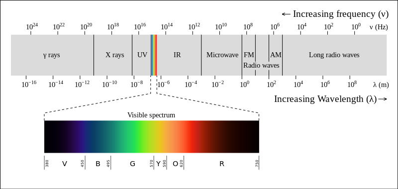
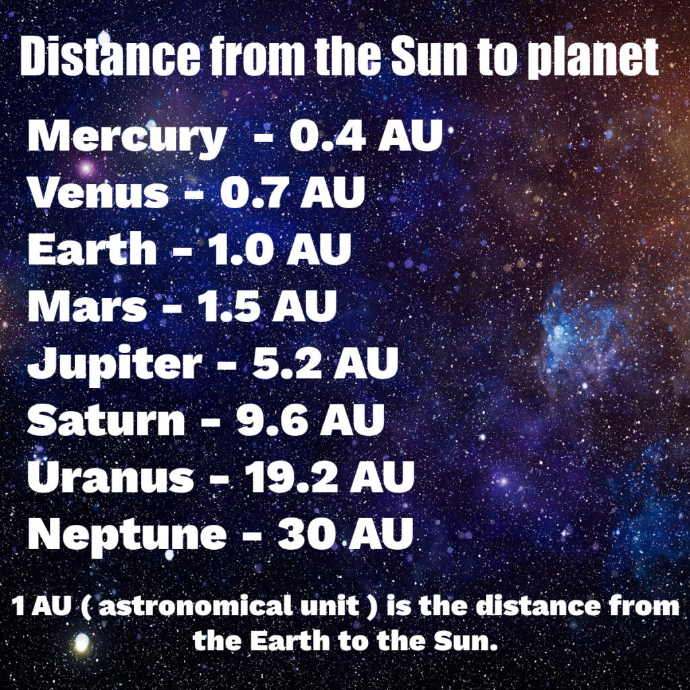

# Homework 2 - Introduction to Astrobiology

## Problem 1. [Radiation laws.]

_On my own_

Radiation laws applied to the stars:

### (a) Find in tables the surface temperature of the Sun, and calculate the maximum of its radiation spectrum.

- $T_{\odot} = 5772 \text{ K}$
- $b = 2.89777 \times 10^{6} \text{ nm K}$

$$
\begin{align*}
\lambda_{\text{max}} &= \frac{b}{T_{\odot}} \\

\lambda_{\text{max}} &= \frac{2.89777 \times 10^{6} \text{ nm K}}{5772 \text{ K}} \\

\lambda_{\text{max}} &\approx 502 \text{ nm} \\

\end{align*}
$$

### (b) Our nearest neighbor, Proxima Centaury, has surface temperature of T = 3000 K. What is the maximum wavelength of its radiation? What part of the spectrum is that?

$$
\begin{align*}
\lambda_{\text{max}} &= \frac{b}{T} \\
\lambda_{\text{max}} &= \frac{2.89777 \times 10^{6} \text{ nm K}}{3000 \text{ K}} \\
\lambda_{\text{max}} &\approx 965.9 \text{ nm} = 9.659 \times 10^{-7} \text{ m} \\
\end{align*}
$$

So its in the infrared part of the spectrum.

### (c) (extra credit) Proxima’s radius is much smaller than that of the Sun. Given that the radius of Proxima Centaury is 15.4% of the solar radius , what is the ratio of their luminosities $L_{PC}/L_⊙$?

$$
\begin{align*}
L &= 4\pi R^2 \sigma T^4 \\
\frac{L_{PC}}{L_{\odot}} &= \frac{4\pi R_{PC}^2 \sigma T_{PC}^4}{4\pi R_{\odot}^2 \sigma T_{\odot}^4} \\
\frac{L_{PC}}{L_{\odot}} &= \frac{R_{PC}^2 T_{PC}^4}{R_{\odot}^2 T_{\odot}^4} \\
\frac{L_{PC}}{L_{\odot}} &= \frac{(0.154* R_{\odot})^2 T_{PC}^4}{R_{\odot}^2 T_{\odot}^4} \\
\frac{L_{PC}}{L_{\odot}} &= \frac{0.154^2 R_{\odot}^2 T_{PC}^4}{R_{\odot}^2 T_{\odot}^4} \\
\frac{L_{PC}}{L_{\odot}} &= 0.154^2 \left(\frac{T_{PC}}{T_{\odot}}\right)^4 \\
\frac{L_{PC}}{L_{\odot}} &= 0.154^2 \left(\frac{3000}{5772}\right)^4 \\
\frac{L_{PC}}{L_{\odot}} &\approx 0.00173 \\
\end{align*}
$$

## Problem 2. [Black body Earth.]

_On my own_

In this problem, you’ll find an important result for the effect of greenhouse
gases. In problem 1, you’ve found the wavelength of the maximum radiation of
the Sun - and clearly that’s also the wavelength at which Earth absorbs most
energy. In this problem you’ll see that the maximum of Earth’s radiation is at
different wavelength. Greenhouse gases are transparent for the wavelengths of
maximum solar radiation, but they absorb energy at the wavelengths at which
Earth radiates energy back to space. In effect they act as a blanket that lets
heat in, but won’t let it out.

## (a) Supposing the Earth is a perfectly black body (which it isn’t!), find the equilibrium temperature of the Earth assuming it is on a circular orbit about the Sun.

$$
\begin{align*}
\frac{L_{\odot}}{16\pi d^2} &= \sigma T^4 \\
\frac{4\pi R_{\odot}^2 \sigma T_{\odot}^4}{16\pi d^2} &= \sigma T^4 \\
\frac{R_{\odot}^2 T_{\odot}^4}{4d^2} &= T^4 \\
\end{align*}
$$

- $d = 1 \text{ AU} = 1.496 \times 10^8 \text{ km}$
- $R_{\odot} = 6.96 \times 10^5 \text{ km}$
- $T_{\odot} = 5772 \text{ K}$

$$
\begin{align*}
\frac{(6.96 \times 10^5 \text{ km})^2 (5772 \text{ K})^4}{4(1.496 \times 10^8 \text{ km})^2} &= T^4 \\
T &\approx 278.38777 \text{ K} \\
\end{align*}
$$

## (b) What is the wavelength of maximum radiation for the Earth temperature you found in part (a)? What part of spectrum is that?

$$
\begin{align*}
\lambda_{\text{max}} &= \frac{b}{T} \\
\lambda_{\text{max}} &= \frac{2.89777 \times 10^{6} \text{ nm K}}{278.38777 \text{ K}} \\
\lambda_{\text{max}} &\approx 10409.1138773805 \text{ nm} = 1.04091138773805 \times 10^{-5} \text{ m} \\
\end{align*}
$$

Part of the infrared spectrum.

## Problem 3. [Earth with albedo.]

_On my own_

In reality Earth is not a perfectly black body and its albedo is about A = 0.31. With this information repeat the calculation form the previous problem. Note that this is still a planet without temperature. You will see that the atmospheric greenhouse gases are necessary to maintain the comfortable range of temperatures for life on our planet. You should find that using the realistic albedo the equilibrium temperature would be far from comfortable.

### (a) With the given albedo, find the equilibrium temperature of the Earth assuming it is on a circular orbit about the Sun.

$$
\begin{align*}
\frac{L_{\odot}(1-A)}{16\pi d^2} &= \sigma T^4 \\
\frac{L_{\odot}(1-0.31)}{16\pi d^2} &= \sigma T^4 \\
\frac{L_{\odot}(0.69)}{16\pi d^2} &= \sigma T^4 \\
\frac{4\pi R_{\odot}^2 \sigma T_{\odot}^4 (0.69)}{16\pi d^2} &= \sigma T^4 \\
\frac{R_{\odot}^2 T_{\odot}^4 (0.69)}{4d^2} &= T^4 \\
\end{align*}
$$

- $d = 1 \text{ AU} = 1.496 \times 10^8 \text{ km}$
- $R_{\odot} = 6.96 \times 10^5 \text{ km}$
- $T_{\odot} = 5772 \text{ K}$

$$
\begin{align*}
\frac{(6.96 \times 10^5 \text{ km})^2 (5772 \text{ K})^4 (0.69)}{4(1.496 \times 10^8 \text{ km})^2} &= T^4 \\
T &\approx 253.725 \text{ K} \\
\end{align*}
$$

### (b) What is the wavelength of maximum radiation for the Earth temperature you found in part (a)? What part of spectrum is that?

$$
\begin{align*}
\lambda_{\text{max}} &= \frac{b}{T} \\
\lambda_{\text{max}} &= \frac{2.89777 \times 10^{6} \text{ nm K}}{253.725 \text{ K}} \\
\lambda_{\text{max}} &\approx 11420.908 \text{ nm} = 1.1420908 \times 10^{-5} \text{ m} \\
\end{align*}
$$

Part of the infrared spectrum.

## Problem 4. [Habitable zone.]

_On my own_

Let us consider the simplest calculation of the circumstellar habitable zone: we will define it as a range of distances in which the black body temperature is between the melting and boiling point of water on Earth’s surface. Note that even though the said temperatures are valid under the pressure of Earth’s atmosphere, we will apply those values in the vacuum. Thus this definition is not to be taken literally (after all, recall that there is no liquid state in vacuum!), it’s just an initial rough estimate that can later be refined.

### (a) With known present solar luminosity, what is the range of habitable zone in the solar system? Express your answer in AU. Which planets fall intothe habitable zone?

- $L_{\odot} = 3.8312915984 \times 10^{26} \text{ W}$
- $T_{\text{low}} = 273 \text{ K}$
- $T_{\text{high}} = 373 \text{ K}$
- $d_{\text{low}} = \sqrt{\frac{L_{\odot}}{16\pi \sigma T_{\text{high}}^4}}$
- $d_{\text{high}} = \sqrt{\frac{L_{\odot}}{16\pi \sigma T_{\text{low}}^4}}$
- $\sigma = 5.67 \times 10^{-8} \text{ W m}^{-2} \text{ K}^{-4}$
- $1 \text{ AU} = 1.496 \times 10^{11} \text{ m}$

$$
\begin{align*}
d_{\text{low}} &= \sqrt{\frac{3.8312915984 \times 10^{26} \text{ W}}{16\pi \sigma (373 \text{ K})^4}} \\
d_{\text{low}} &\approx 8.33 \times 10^{10} \text{ m} = 0.557 \text{ AU} \\
\end{align*}
$$

$$
\begin{align*}
d_{\text{high}} &= \sqrt{\frac{3.8312915984 \times 10^{26} \text{ W}}{16\pi \sigma (273 \text{ K})^4}} \\
d_{\text{high}} &\approx 1.5557 \times 10^{11} \text{ m} = 1.0399 \text{ AU} \\
\end{align*}
$$

So Earth and Venus do

### (b) Early in the history of the solar system, the solar luminosity was about 70% of the present value. Calculate the habitable zone in this case, and ex- press your answer in AU. Which planets fall within the ’habitable’ range?

- $L_{\odot} = 0.7 \times 3.8312915984 \times 10^{26} \text{ W}$
- $d_{\text{low}} = \sqrt{\frac{L_{\odot}}{16\pi \sigma T_{\text{high}}^4}}$
- $d_{\text{high}} = \sqrt{\frac{L_{\odot}}{16\pi \sigma T_{\text{low}}^4}}$

$$
\begin{align*}
d_{\text{low}} &= \sqrt{\frac{0.7 \times 3.8312915984 \times 10^{26} \text{ W}}{16\pi \sigma (373 \text{ K})^4}} \\
d_{\text{low}} &\approx 6.972 \times 10^{10} \text{ m} = 0.465 \text{ AU} \\
\end{align*}
$$

$$
\begin{align*}
d_{\text{high}} &= \sqrt{\frac{0.7 \times 3.8312915984 \times 10^{26} \text{ W}}{16\pi \sigma (273 \text{ K})^4}} \\
d_{\text{high}} &\approx 1.301577 \times 10^{11} \text{ m} = 0.87003 \text{ AU} \\
\end{align*}
$$

Only Venus would
