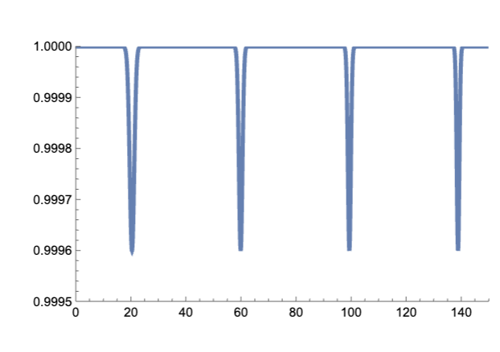
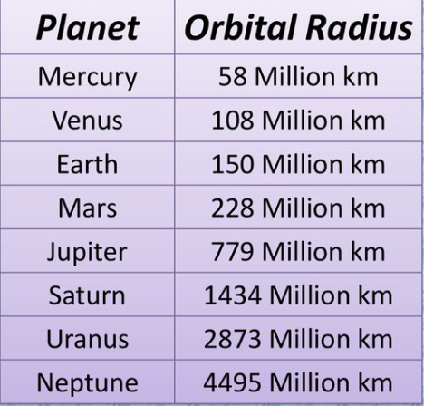
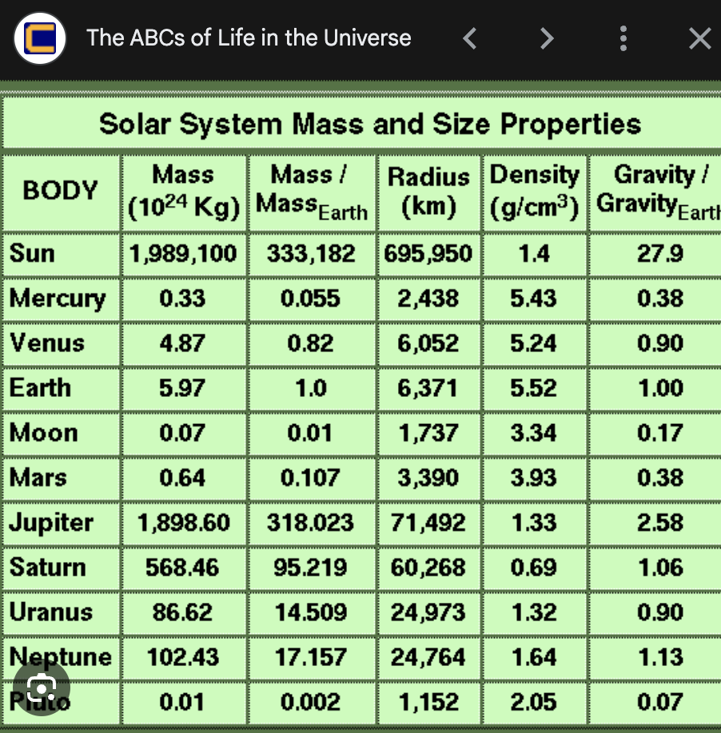
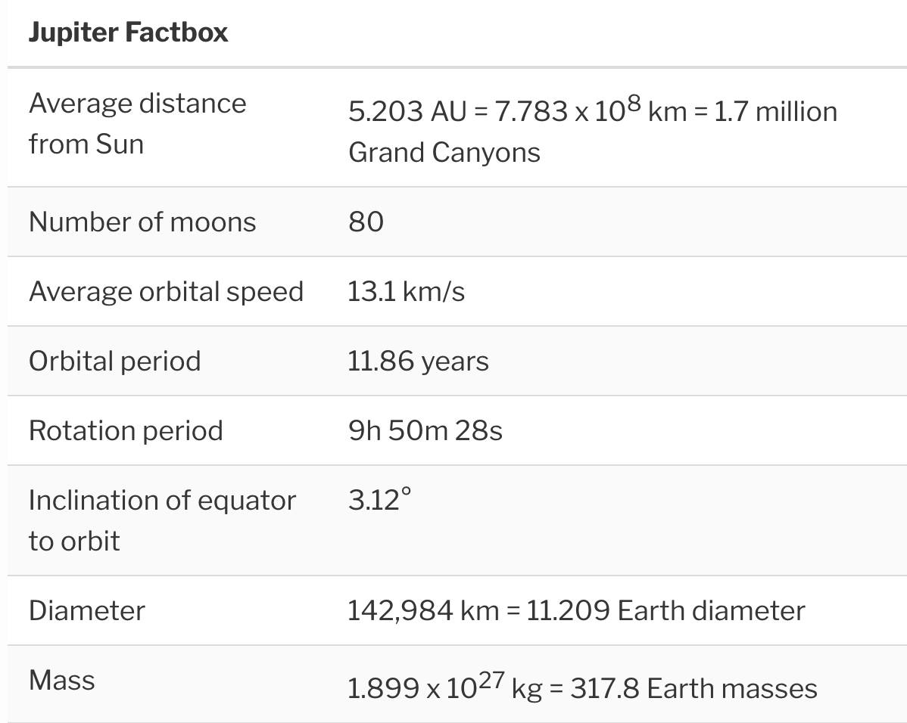
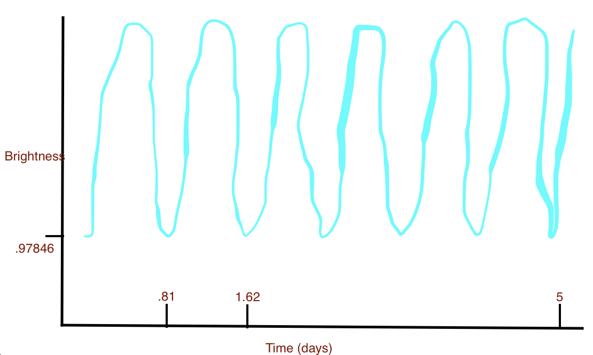

# Homework 3 - Intro to Astrobiology

## Question 1 - A planet orbiting the star the same as our Sun is discovered using the transit method. The plot of the observation is shown in the the figure, where on the horizontal axis is the observational period expressed in days, and on the verti- cal axis is the drop in the observed brightness of the star.

### a) Explicitly state what is the fraction of light that is blocked by the planet, and what is the orbital period of the planet.

#### Fraction of light blocked by the planet

$$
1 - .99958 = .00042
$$

#### Orbital period of the planet

$$
60 - 20  = 40 days
$$

### alculate the orbital radius of the planet. How does that orbital radius compare to those of the planets in solar system?

- $G = 6.67 x 10^{ -11 } N m^2/kg^2$
- $M = 1.99 x 10^{30} kg$
  $$
  d = \bigg( \frac{G M }{4 \pi^2} T^2 \bigg)^{1/3} \\
  d = \bigg( \frac{6.67 \times 10^{-11} \times 1.99 \times 10^{30}}{4 \pi^2} \times (40 \times 24 \times 3600)^2 \bigg)^{1/3} \\
  d = 3.424 \times 10^{10} m
  $$

As you can see, it is about the same as the distance between Mars and Jupiter.

### (extra credit) Calculate the radius of the planet. How does the planetary radius compare with the planets in the solar system?

- $R = 6.9595 \times 10^8 m$

  $$
  r = R \times \sqrt{x} \\
    r = 6.9595 \times 10^8 \times \sqrt{.00042} \\
    r = 1.426 \times 10^7 m
  $$

  

  As you can see, it is between the radius of the Earth and Uranus.

## Problem 2 - Doppler Method

### a) Look up mass of Jupiter and orbit speed

- $M = 1.899 \times 10^{27} kg$
- $ v = 13.1 km/s$

### b) Consider the Sun and Jupiter as the only two bodies in the solar system. What is the speed of the Sun due the motion about the common center of mass of the Sun-Jupiter system?

- $M_{sun} = 1.989 \times 10^{30} kg$
- $M_{jupiter} = 1.899 \times 10^{27} kg$

  $$
  v_{sun} = \frac{M_{jupiter} v_{jupiter}}{M_{sun}} \\
  v_{sun} = \frac{1.899 \times 10^{27} \times 13.1 \times 10^3}{1.989 \times 10^{30}} \\
  v_{sun} = 1.251 m/s
  $$

### c) extra credit) The extraterrestrials are observing motion of the Sun using the sodium absorption line at wavelength λ = 589.5924 nm. What is the shift in wavelength ∆λ due to the motion of the Sun?

$$
\Delta \lambda = \frac{v_{sun}}{c} \lambda \\
\Delta \lambda = \frac{1.251}{3 \times 10^8} \times 589.5924 \times 10^{-9} \\
\Delta \lambda = 2.4597 \times 10^{-6} nm
$$

## Problem 3 3 - Hot Jupiter is an exoplanet gas giant that is orbiting very close to the parent star, so that its period is of the order of ten days (or less). A hot Jupiter is observed orbiting a red dwarf with mass M = 0.64MSU N and radius R = 0.63RSU N . The period of the planetary orbit is observed to be T = 0.81 days. The planet has been observed by both transit and Doppler shift method. Plan- etary mass and radius expressed in the units of Jupiter as m = 1.8mJup and r = 0.9rJup.

### a) Find the distance at which the planet orbits the parent star.

- $G = 6.67 \times 10^{-11} N m^2/kg^2$
- $M_{star} = 0.64 \times 1.989 \times 10^{30} kg$
- $T = 0.81 \times 24 \times 3600 s$

$$
d = \bigg( \frac{G M_{star}}{4 \pi^2} T^2 \bigg)^{1/3} \\
d = \bigg( \frac{6.67 \times 10^{-11} \times 0.64 \times 1.989 \times 10^{30}}{4 \pi^2} \times (0.81 \times 24 \times 3600)^2 \bigg)^{1/3} \\
d = 2.192 \times 10^9 m
$$

### b) Plot the observed brightness of the star-planet system during the five days interval, similar to the plot from Problem 1. Make sure to label the size of the dips, again as shown in Problem 1

- $R_{star} = 0.63 \times 6.9595 \times 10^8 m$
- $r_{planet} = 0.9 \times 7.1492 \times 10^7 m$

$$
\frac{r_{planet}}{R_{star}} = \sqrt{x} \\
x = .02154
$$

On graph it should be $1-x = 0.97846$

### c) (extra credit) Find the speed of the star, due to the motion around the center of mass of the planet-star system. Not that this is the speed that was observed in the Doppler shift method.

- $M_{planet} = 1.8 \times 1.899 \times 10^{27} kg$
- $v_{planet} = 13.1 km/s$

$$
v_{star} = \frac{M_{planet} v_{planet}}{M_{star}} \\
v_{star} = \frac{1.8 \times 1.899 \times 10^{27} \times 13.1 \times 10^3}{0.64 \times 1.989 \times 10^{30}} \\
v_{star} = 35.18 m/s
$$

## Problem 4 - The Drake Equation

$$
N = R_{\ast} \times f_p \times n_e \times f_l \times f_i \times f_c \times L
$$

### a) Using the Drake equation, make an estimate of the number of civilization in the Milky Way at the present time that have technology to communicate with us. Explicitly state all numerical values you were using.

https://en.wikipedia.org/wiki/Drake_equation#:~:text=ne%20=%201%20to%205,planets%20capable%20of%20developing%20life)

- $R_{\ast} = 2$
- $f_p = 1$
- $n_e = .4$
- $f_l = .1$
  - eh
- $f_i = 1$
  - eh 2.0
- $f_c = .1$
- $L = 420$
  - Michael Shermer estimate

Estimate = 3.36 civilizations

### b) Milky Way is only one of about 1011 galaxies in the observable universe. Assuming that all galaxies are just like ours, make an estimate of the number of civilizations that exist in the observable universe. Comment on your result

$3.36 \times 10^{11}$ civilizations

This is part of the reason why I think we won't find any intelligent civilizations. The chance that we are the first lifeforms that develop the technology to communicate with other civilizations is unimaginable.

So aliens are either hiding or they are not there. Or maybe we live in a "simulated" reality.

### c) xtra credit) Bearing in mind your results from parts (a) and (b), specu- late on the possible resolutions of the Fermi paradox - Where is everybody? – 6 –

LIke I said above, either aliens are hiding, are not there, or we live in a reality created by a higher intelligence.
