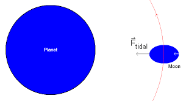
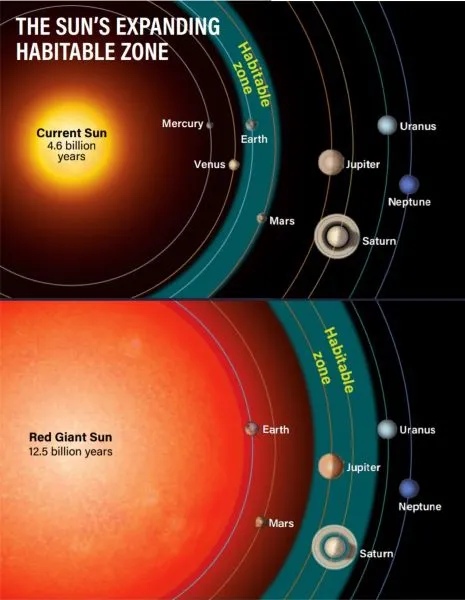

# Intro To AstroBiology Quiz 2 Prep

## Practice Questions

### What is the correct order of magnitude of the mass of Mars

$6.42 \times 10^{23}$ kg or $10%$ of Earth's mass

### We believe there is a liquid ocean under the surface ice of Europa? What is the main reason we find liquid water an object at 5.2 AU from the Sun?

Dissipation of Jupiter's tidal force

Basically, the tidal force of Jupiter is causing the moon to flex and heat up, creating a liquid ocean under the surface ice.

### Which one of the following is true about the habitable zone around the Sun in 1 billion years.

As stars evolve on the main sequence, they become brighter and hotter. This makes the habitable zone move out with time

### Which method has produced by far the most discoveries of exoplanets?

**Transit method** - looking for the dimming of a star as a planet passes in front of it

Other methods include:

- **Doppler (Radial Velocity) Method** - looking for the shift in the spectrum of a star as it moves towards or away from us due to the gravitational pull of a planet
- **Direct imaging** - taking a picture of a planet next to a star
- **Gravitational microlensing** - looking for the bending of light from a background star as a planet passes in front of it.

### Consider the exoplanets discovered by the transit method and by the Doppler shift method. Which method will yield the orbital period of the planet?

- **Transit method** - the time between transits is the orbital period
- **Doppler shift method** - the time between shifts is the orbital period

### What type of hypothetical device is called the Dyson sphere? It is related to the method of producing energy for a very advanced civilization.

A Dyson Sphere is a hypothetical megastructure that encompasses a star and captures a large percentage of its power output.

### The briefest statement of the Fermi paradox is:

If there are many advanced civilizations in the galaxy, why haven't we seen any evidence of them?

### Why is the main reason Mars lost it's magnetic field, whereas the Earth still has it?

Mars is smaller than Earth and cooled off faster, so it's core solidified and stopped generating a magnetic field.

### What is Titan?

- A moon of **Saturn**
- Has a thick atmosphere made mostly of nitrogen
- Has large hydrocarbon lakes
- Atmospheric pressure is 1.5 times that of Earth
- Mass is 1.8% of Earth's mass

### What is a black body?

- A perfect absorber and emitter of radiation
- The spectrum of radiation emitted by a black body is continuous and depends only on its temperature
  - $B_{\lambda} = \frac{2hc^2}{\lambda^5} \frac{1}{e^{\frac{hc}{\lambda kT}} - 1}$
    - $B_{\lambda}$ is the spectral radiance
    - $h$ is Planck's constant
    - $c$ is the speed of light
    - $\lambda$ is the wavelength
    - $T$ is the temperature
    - $k$ is Boltzmann's constant
- The peak of the spectrum shifts to shorter wavelengths as the temperature increases

### What method of exoplanet detection can you directly yield the radius of the planet?

**Transit method** - the amount of dimming of the star is related to the size of the planet

### What is the most likely scenario of detecting the life on exoplanets?

- **Atmospheric composition** - looking for gases that are out of equilibrium. If there is oxygen in the atmosphere, it is likely being produced by life so look for the oxygen absorption line in the spectrum of the planet

### Charactersitics of the Habitable Zone

- Theres not liquid water on all planets in the habitable zone
- The habitable zone is different for different types of stars
- Defined for perefectly black bodies (no atmosphere)

### In estimating properties of the exoplanet we need to know the mass of the home star. How do we determine the mass of the star?

From the spectrum of the star, we can determine the spectral type and luminosity class. From this, we can determine the mass of the star

### What was the Arecibo signal?

A radio signal sent from the Arecibo radio telescope in 1974 towards the globular cluster M13. It was a binary message that included information about the structure of DNA, the solar system, and the telescope itself. The length of the message was 1679 bits which is a semiprime number (23 x 73). It was really to demonstrate the capabilities of the telescope but it was still a message to potential extraterrestrial civilizations.

### When was the first artificial satellite launched?

1950s - Sputnik 1 by the Soviet Union
