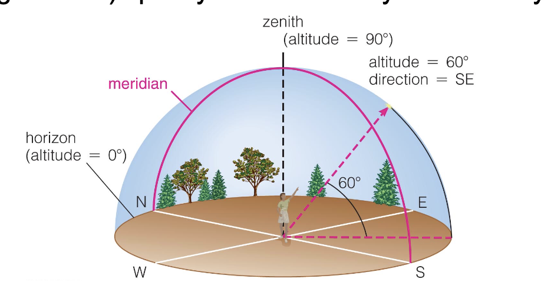
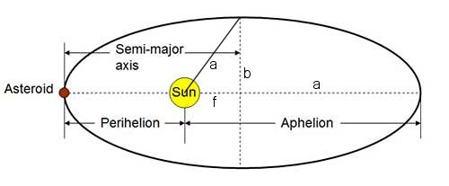
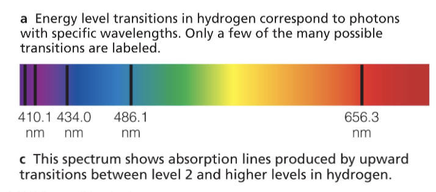

# Astronomy - Exam 1 - Study Guide

## Celestial Sphere

**Ecliptic** - The path the sun takes through the sky over the course of a year.

### Local Sky

- **Zenith** - The point directly above you.
- **Horizon** - All points 90 degrees away from the zenith.
- **Meridian** - The line that goes from the north point on the horizon, through the zenith, to the south point on the horizon.
- **Azimuth** - The angle along the horizon.

**Altitude** and **Direction** are used to describe the position of an object in the local sky.

### Coordinates

#### Earth

- **Latitude** - North or south from the equator
- **Longitude** - East or west from the prime meridian

#### Star

- **Declination** - North or south
- **Right Ascension** - East or west

## Kepler's Laws

### Kepler's First Law

The orbit of a planet is an ellipse with the Sun at one of the two foci

One tack is the sun.

### Kepler's Second Law

A line segment joining a planet and the Sun sweeps out equal areas during equal intervals of time

$$ A = B $$

### Kepler's Third Law

$$
P^2 \propto r^3
$$

The square of the orbital period of a planet is directly proportional to the cube of the semi-major axis of its orbit

$$
\begin{align*}
\frac{GM}{4\pi^2} & = \frac{d^3}{T^2} \\
\end{align*}
$$

So we know that ratio is a constant

### Newton's Version

$$
P^2 = \frac{4\pi^2}{G(M_1 + M_2)}a^3
$$

- $P$ is the orbital period
- $G$ is the gravitational constant
- $M_1$ and $M_2$ are the masses of the two objects
- $a$ is the semi-major axis of the orbit

## Gravity

$$
F = \frac{GM_1M_2}{R^2}
$$

### Orbital Velocity

$$
v = \sqrt{\frac{GM}{R}}
$$

- $v$ is the orbital velocity
- $G$ is the gravitational constant ($6.674 \times 10^{-11} \text{m}^3 \text{kg}^{-1} \text{s}^{-2}$)
- $M$ is the mass of the object being orbited
- $R$ is the distance between the two objects

### Escape Velocity

$$
v_{\text{escape}} = \sqrt{\frac{2GM}{R}}
$$

### Conservation of Angular Momentum

$$
L = mvr
$$

- $L$ is the angular momentum
- $m$ is the mass of the object
- $v$ is the velocity of the object

### Conservation of Energy

$$
E = \frac{1}{2}mv^2 - \frac{GMm}{r}
$$

## Important Numbers

- **Gravitational Constant ($G$)** : $6.674 \times 10^{-11} \text{m}^3 \text{kg}^{-1} \text{s}^{-2}$
- **Mass of the Earth** : $5.972 \times 10^{24} \text{kg}$
- **Mass of the Sun** : $1.989 \times 10^{30} \text{kg}$
- **Distance from the Earth to the Sun** : $1.496 \times 10^{11} \text{m}$ = 1 AU
- **Radius of the Earth** : $6.371 \times 10^{6} \text{m}$

## Light

### Wavelength ($\lambda$)

The distance between two peaks in a wave.

### Frequency ($f$)

The number of peaks that pass a point in a given time. Corresponds to the color of light and the energy of the light.

### Speed of Light ($c$)

$$
c = \lambda f \\
c = 3.00 \times 10^8 \text{m/s}
$$

### Energy of Light

$$
E = hf
$$

- $E$ is the energy of the light
- $h$ is Planck's constant ($6.626 \times 10^{-34} \text{J s}$)

### Spectra

The colors of light emitted by an object.

#### Continuous Spectra

Spans all visible wavelengths without interruption

#### Emission Line Spectra

Only emits light at specific wavelengths. Like a thin gas cloud.

#### Absorption Line Spectra

When something like a gas cloud absorbs light at specific wavelengths.

### Chemical Fingerprints

Each element has a unique set of energy levels and therefore a unique set of spectral lines.

By looking at the absorption or emission lines of a star, we can determine what elements are present in the star.

### Wein's Law

$$
\lambda_{\text{max}} = \frac{b}{T}
$$

- $\lambda_{\text{max}}$ is the peak wavelength
- $b$ is Wien's displacement constant ($2.90 \times 10^{-3} \text{m K}$)

### Doppler Effect

$$
\frac{\Delta \lambda}{\lambda} = \frac{v}{c}
$$

- $\Delta \lambda$ is the change in wavelength
- $\lambda$ is the original wavelength
- $v$ is the velocity of the object
- $c$ is the speed of light

## Telescopes

### Light Collecting Area

The area of the primary mirror that collects light. Increases with the square of the diameter (alot more than our eyes)

### Angular Resolution

The smallest angle over which we can tell that two objects are distinct.

$$
\theta_{\text{min}} = \frac{1.22\lambda}{D}
$$

### Types of Telescopes

#### Refracting Telescopes

Uses lenses to focus light.

#### Reflecting Telescopes

Uses mirrors to focus light.

#### X-Ray Telescopes

Uses mirrors to focus x-rays.

### Why we send telescopes into space

- Light pollution
- Atmosphere absorbs certain wavelengths
- Turbulence causes stars to twinkle. The temperature of the air changes the refractive index of the air.
