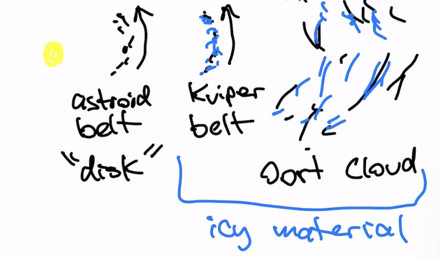
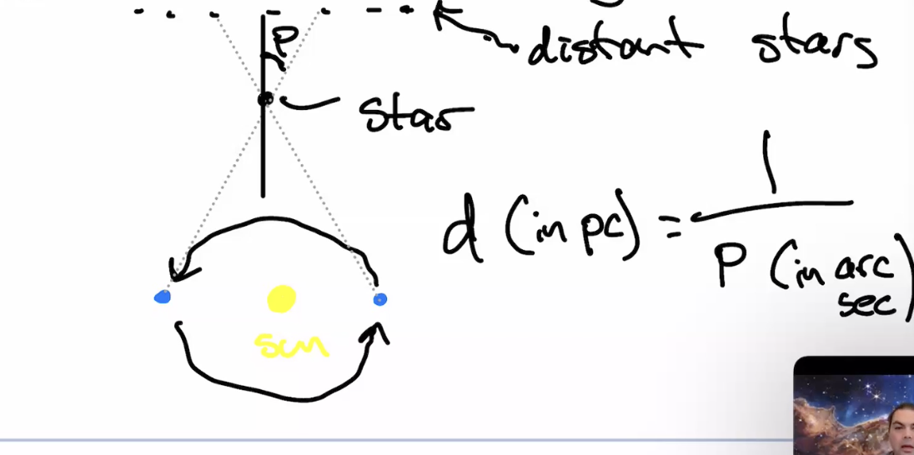
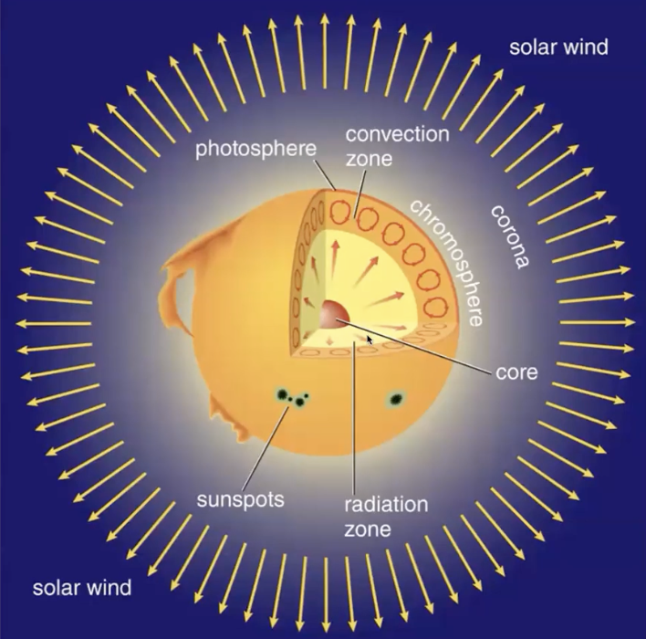
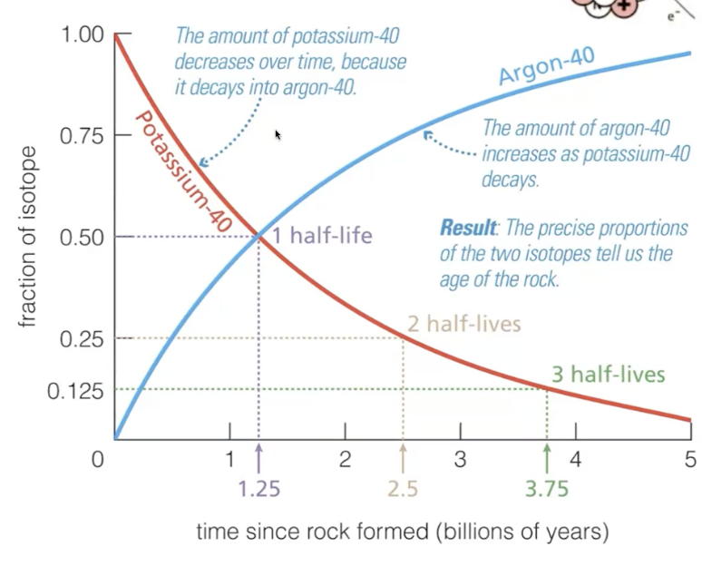
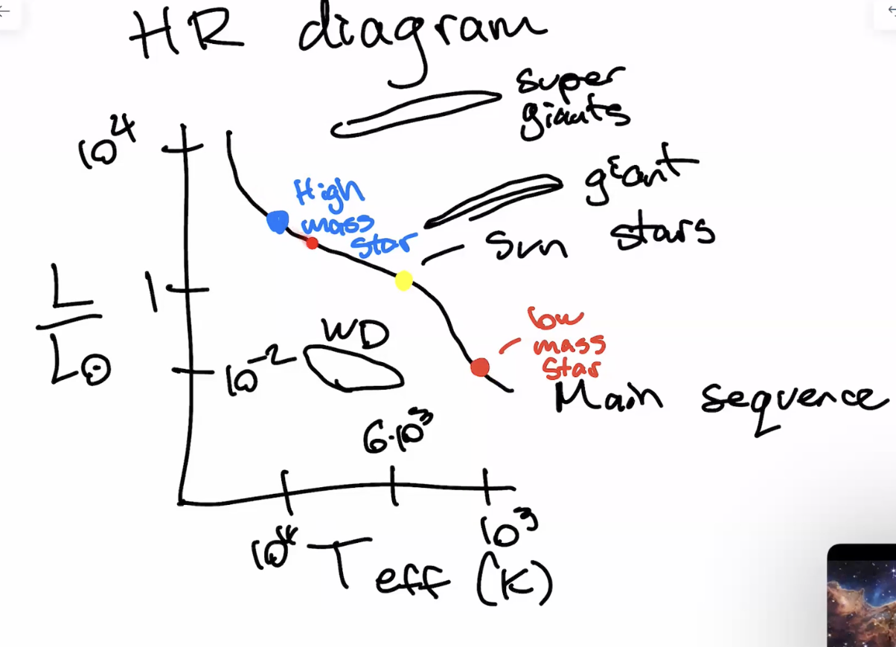
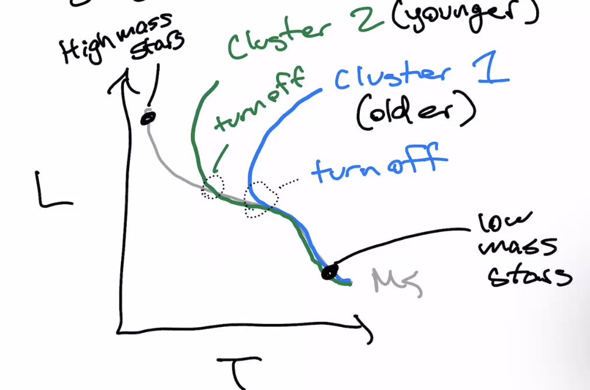

# Astronomy - Exam 2 - Study Guide

## Overview

Slides 8c - 9c (Small Bodies - Star Stuff) [9 A,B,C are important] [8a might also be on it] [Radioactive decay in slide 7 too]

### Notes

- HR Diagram - Know everything about it. Like if you mark two spots be able to know which is larger. Main sequence turnoff
- Asteroid Belt, Keiper Belt, Oort Cloud
  - Where they are located
  - 
  - Asteroid and Keiper Belt are in the same plane as the planets (disk)
  - Oort Cloud is a sphere around the solar system
  - Comets usually come the these two regions
  - Asteroids come from the asteroid belt

### Star Fomration

Molecular Clouds - Mainly H2 - ~100 atoms / cm^3 - ~30 K

- Overdense regions collapse under gravity
- Gravity is trying to condense the cloud into smaller (more dense) regions
- Pressure is trying to prevent that.
- So it radiates heat to lower the pressure and collapse.
- Forms a **protostar** - a star that is still forming.
- Continues collapsing until fusion starts in the core and a **star** is born.

During the collapse we a **accretion disk** forms around the protostar. This happens because the angular momentum of the cloud is conserved.

$$
\text{Angular Momentum} = \text{Mass} \times \text{Velocity} \times \text{Radius}
$$

As the cloud collapses, it spins faster and faster. The inner part of the cloud collapses faster than the outer part. Due to collisions, the cloud flattens into a disk.

### Stellar Paralax

- You can measure the distance to a star by measuring the angle between the star and the sun at two different times of the year.
  

$$
\text{Distance (parsecs)} = \frac{1}{\text{Paralax (arcseconds)}} \\
60 \text{ arcseconds} = 1 \text{ arcminute} \\
60 \text{ arcminutes} = 1 \text{ degree} \\
$$

### The Sun

- **The Core** - Where fusion happens
- **Radiative Zone** - Photons are bouncing around and electrons are absorbing and re-emitting them. So the energy is being transported by radiation (dominantly).
- **Convection Zone** - Energy is transported by convection. Hot gas rises and cool gas falls.
- **Photosphere** - The surface of the sun. Photons are emitted from here which is what we see.
- **Chromosphere** - The layer above the photosphere. It is hotter than the photosphere probably because of magnetic fields.
- **Corona** - The outermost layer of the sun. It is very hot and very low density. Hotter than the chromosphere.

### Sunspots

- Dark spots on the sun. They are cooler than the surrounding area.
- Highly magnetized regions where the magnetic field is strong enough to suppress convection.
- 11 year cycle (because magnetic fields flip every 11 years)

### Radioactive Decay

Measure how fast a radioactive isotope decays based on the half-life of the isotope (time it takes for half of the isotope to decay).

Decay of **Potassium-40** to **Argon-40** is used to date rocks.

- Potassium-40 has a half-life of 1.3 billion years.
- Measure the ratio of Potassium-40 to Argon-40 in a rock to determine the age of the rock.
  - 

$$
N = N_0 \frac{1}{2}^{\frac{t}{T_{1/2}}} \\
t = t_{\text{half}} \times \log_2 \left( \frac{N_0}{N} \right)
$$

### Patterns Among Stars

## Low Mass Stars

- $M < 8 M_{ sun }$
- Less luminous
- Longer lifetime
- Main Sequence
- H -> He fusion
- Done through the **Proton-Proton Chain** (a series of reactions that convert hydrogen into helium)
- Depleats H in the core
  - Moves off main sequence
  - **Giant** Phase
    - H -> He fusion in a shell around the core
    - He flash - He -> C fusion in the core
    - Double shell burning
      - Outer layer is ejected as a **Planetary Nebula**
      - Core is left behind as a **White Dwarf**

## High Mass Stars

- $M > 8 M_{ sun }$
- More luminous
- Shorter lifetime
- Main Sequence
- H -> He fusion
- Done through the **CNO Cycle** (a series of reactions that convert hydrogen into helium)
- Depleats H in the core
  - Moves off main sequence
  - **Supergiant** Phase
    - Multiple shells of fusion
      - He -> C
      - C -> O
      - O -> Ne
      - Ne -> Mg
      - Mg -> Si
      - Si -> Fe
    - Iron core collapses
      - Implosion -> Explosion
      - Sheds outer layers as a **Supernova**
      - Core is left behind as a **Neutron Star** or **Black Hole**

Lower Mass Limit - $0.08 M_{ sun }$ - Below this mass, electron degeneracy pressure will prevent the star from collapsing further. - The star will become a **Below Dwarf**.

Upper Mass Limit - $150 M_{ sun }$ - Above this mass, the star will be so luminous that it will blow off its outer layers before it can collapse into a **black hole**.

You can estimate mass from the HR diagram. The more massive a star is, the more luminous it is

$$
L = 4 \pi R^2 \sigma T^4
$$

Where $\sigma$ is the Stefan-Boltzmann constant ($5.67 \times 10^{-8} \text{ W m}^{-2} \text{ K}^{-4}$)

or

$$
L = 4 \pi d^2 F
$$

Where $F$ is the flux (energy per unit area per unit time) and $d$ is the distance to the star.

### Aging Cluster (Main Sequence Turnoff)

Clusters of stars are born at the same time. So if you look at a cluster of stars, you can see how old they are by looking at the main sequence turnoff.

Why? Because the more massive a star is, the faster it goes through its life cycle. So we can look at the most massive stars that are still on the main sequence and estimate the age of the cluster.

## Key Questions

- What are the Oort cloud, Kuiper belt and asteroid belt?

**Oort Cloud** - A spherical cloud of comets that surrounds the solar system. It is the source of long period comets.

**Kuiper Belt** - A disk of icy bodies that lies beyond Neptune. It is the source of short period comets.

**Asteroid Belt** - A disk of rocky bodies that lies between Mars and Jupiter. Source of asteroids.

- Where do comets come from and what are they made out of?

  - Comets come from the Oort cloud and Kuiper belt.
  - They are made of ice and dust.

- What shapes a comet’s tail?

      - **Solar Wind** - Caused by the sun. It is a stream of charged particles that flows out from the sun.
      - The solar wind pushes the dust and gas away from the comet. The dust forms a tail that is curved because the solar wind is not uniform.

- Where are most the observed asteroids in the solar system?

  - The asteroid belt

- Why is Pluto not a planet?

  - It is not massive enough to clear its orbit of other debris so its constantly colliding with other objects. It is also in the Kuiper belt.

- How do we detect exoplanets?

  - **Exoplanets** - Planets that orbit other stars.
  - **Radial Velocity** - Look for the star to wobble as the planet orbits it. Caused by the gravitational pull of the planet.

- How do stars form?

  - **Molecular Clouds** - Mainly H2 - ~100 atoms / cm^3 - ~30 K
  - Overdense regions collapse under gravity
  - Gravity is trying to condense the cloud into smaller (more dense) regions
  - Pressure is trying to prevent that.
  - So it radiates heat to lower the pressure and collapse.
  - Forms a **protostar** - a star that is still forming.
  - Continues collapsing until fusion starts in the core and a **star** is born.

- Understand solar activity, the solar cycle, and sunspots.

  - **Solar Cycle** - The 11 year cycle of the sun. It is caused by the sun's magnetic field flipping every 11 years.
  - **Sunspots** - Dark spots on the sun. They are cooler than the surrounding area.

- What does it mean for a star to be on the main sequence?

  - It is fusing hydrogen into helium in its core.

- Understand how various stellar properties change as you move along the main sequence on the HR diagram .

  - **Main Sequence Turnoff** - The most massive stars that are still on the main sequence. We can use this to estimate the age of a cluster.
  - The more massive a star is, the more luminous it is. But it also goes through its life cycle faster.

- For a main sequence star, how do radius, luminosity, and expected lifetime change with mass?

  - The more massive a star is, the more luminous it is. But it also goes through its life cycle faster.

- Understand main sequence turn off and how we use it to date stellar clusters

  - Clusters of stars are born at the same time. So if you look at a cluster of stars, you can see how old they are by looking at the main sequence turnoff. The more massive a star is, the faster it goes through its life cycle. So we can look at the most massive stars that are still on the main sequence and estimate the age of the cluster.

- Understand star spectral types

  - **OBAFGKM** - The spectral types of stars. O is the hottest and M is the coolest.
  - O stars are blue and M stars are red
  - Pynemonic - **Oh Be A Fine Girl Kiss Me**

- What are the upper and lower stellar mass limits and what causes these mass limits?

  - **Lower Mass Limit** - $0.08 M_{ sun }$ - Below this mass, electron degeneracy pressure will prevent the star from collapsing further. - The star will become a **Below Dwarf**.
  - **Upper Mass Limit** - $150 M_{ sun }$ - Above this mass, the star will be so luminous that it will blow off its outer layers before it can collapse into a **black hole**.

- Describe the various life phases that our Sun has gone through and will go through.

  - **Main Sequence** - The sun is currently in this phase. It is fusing hydrogen into helium in its core.
  - **Giant** Phase - H -> He fusion in a shell around the core. He flash - He -> C fusion in the core. Double shell burning. Outer layer is ejected as a **Planetary Nebula**. Core is left behind as a **White Dwarf**

- Do the same for a very massive star.

  - **Main Sequence** - The star is fusing hydrogen into helium in its core.
  - **Supergiant** Phase - Multiple shells of fusion. He -> C. C -> O. O -> Ne. Ne -> Mg. Mg -> Si. Si -> Fe. Iron core collapses. Implosion -> Explosion. Sheds outer layers as a **Supernova**. Core is left behind as a **Neutron Star** or **Black Hole**

- Roughly what is the stellar mass that separates low mass stars from high mass stars?

  - $8 M_{ sun }$

- Depending on mass, what are the various and states you could get for a star?

  - **Low Mass Stars**
    - **Main Sequence**
    - **Giant** Phase
    - **White Dwarf**

- **High Mass Stars**

  - **Main Sequence**
  - **Supergiant** Phase
  - **Supernova**
  - **Neutron Star** or **Black Hole**

- How does the luminosity of a star relate to its temperature in radius?

      - The more massive a star is, the more luminous it is. But it also goes through its life cycle faster.
      - $L = 4 \pi R^2 \sigma T^4$

- What’s the relation between luminosity distance and brightness?

  - $L = 4 \pi d^2 F$ - This equation gives you the luminosity of a star based on its distance and brightness from the observer.

- Roughly what fraction of stars are in binary systems?
  - **Binary Stars** - Stars that orbit each other. Roughly 50% of stars are in binary systems.
