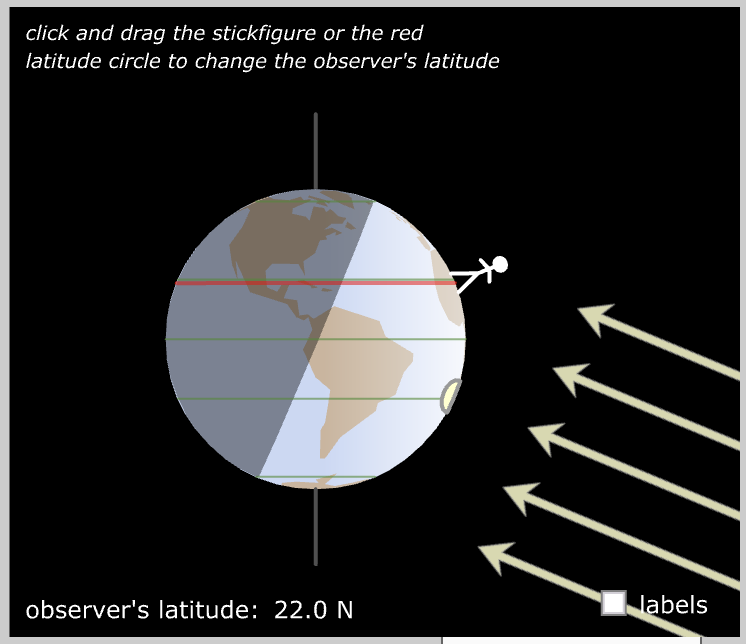
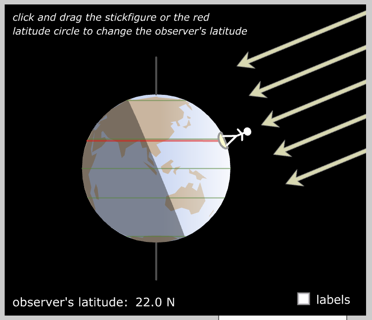
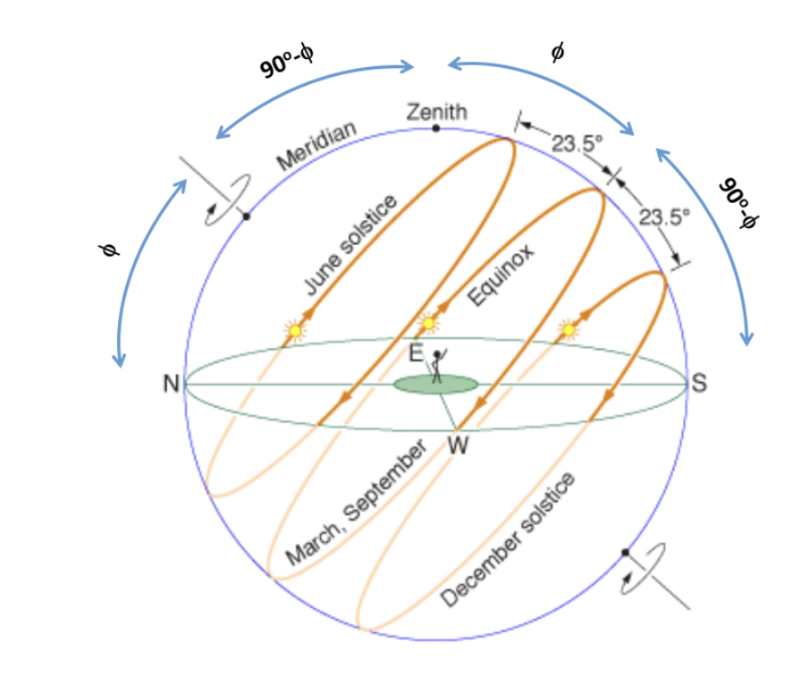
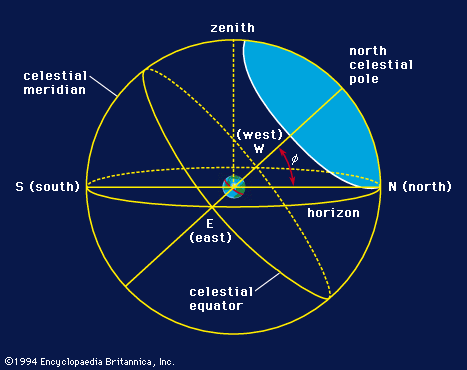
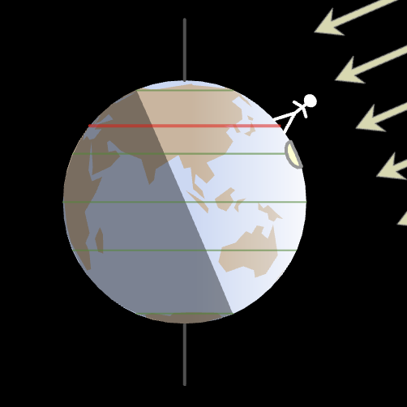
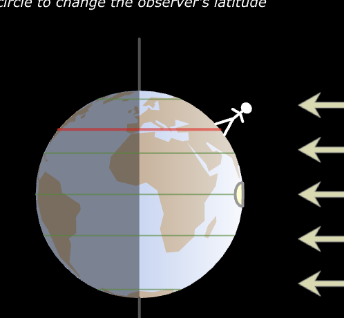
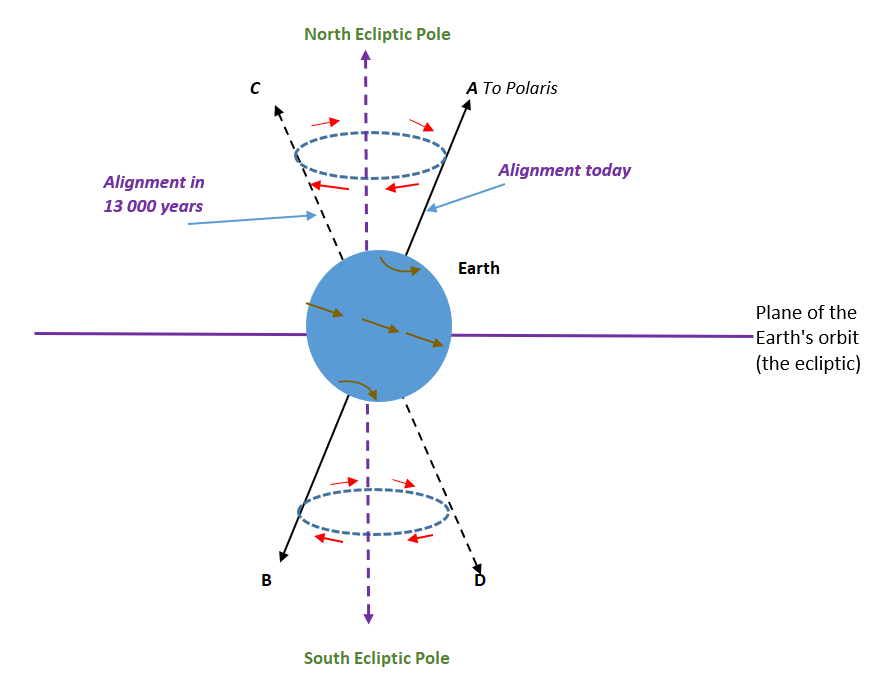
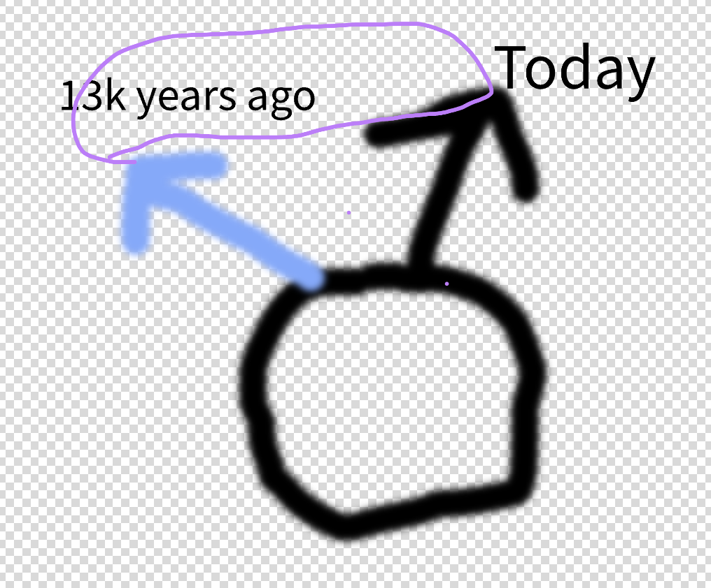
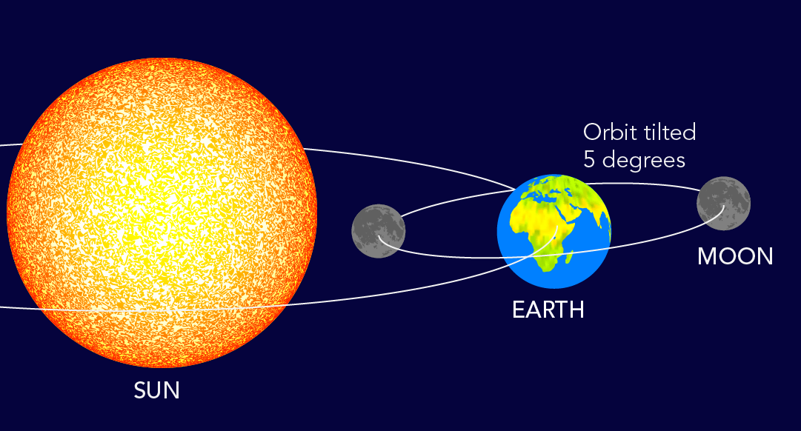

# Intro To Astronomy HW 1

## 1.) Explain if there'd be sesasons on Earth

### a.) Earth has no tilt and is perfectly perpendicular to the ecliptic plane

There would be no seasons because there would be no variation in the amount of sunlight that reaches the Earth. The amount of time that both hemispheres receive sunlight would be the same.

This image is from the beginning of December. You can see that due to the position of the Earth, the Northern Hemisphere is receiving less sunlight than the Southern Hemisphere.

This image is from the beginning July, and because of the position of the Earth- it s the opposite of the previous image.

### b.) Earth's axis is completely in the ecliptic plane

If the Earth's axis was completely in the ecliptic plane, the seasons would be more extreme. During the Northern Hemisphere's summer, the North Pole would always be facing the Sun and the South Pole would always be facing away from the Sun. The opposite would be true for the Southern Hemisphere.

## 2.)

### a) Calculate what 1 light-minute is in meters. You have to start from the definition, distance travelled by light (in vacuum) in one minute, and show all the steps. You’ll not get any point if you simply quote a result from the internet or other sources.

- The speed of light is $3.00 \times 10^8 m/s$
- The time is 60 seconds

$$
\begin{align*}
d & = v \times t \\
& = (3.00 \times 10^8 m/s) \times (60 s) \\
& = 1.80 \times 10^{10} m
\end{align*}
$$

### b) (2 points) The average distance between the Sun and Jupiter is 5.2AU = 7.8e8 km. Use your result in a) to calculate what the average distance between the Sun and Jupiter is in light- minute (and think about what it means in terms of the travel time of sunlight towards Jupiter.)

$$
\begin{align*}
\frac{7.8 \times 10^{11} m}{1.80 \times 10^{10} \frac{m}{\text{min}}} & = 43.3 \text{ light-minutes}
\end{align*}
$$

## 3.)

### a) If those little sugar cubes for coffee are made of materials from a neutron star whose average density is 5e17 kg/m3 , what would the mass of such a cube be in kg? Assume the side of the cube is 1 cm.

$$
\begin{align*}
V & = l^3 \\
& = (0.01 m)^3 \\
& = 1 \times 10^{-6} m^3
\\ \\
m & = \rho \times V \\
& = (5 \times 10^{17} \frac{kg}{m^3}) \times (1 \times 10^{-6} m^3) \\
& = 5 \times 10^{11} kg
\end{align*}
$$

### b) How many empire state buildings (3.3e8 kg) would that be?

$$
\begin{align*}
\frac{5 \times 10^{11} kg}{3.3 \times 10^8 kg} & = 1.52 \times 10^3
\end{align*}
$$

## 4.)

For Hoboken (latitude 41 deg)

### a.) What is the angle between the zenith and the north celestial pole?

$$
\begin{align*}
90 - 41 & = 49 \text{ degrees}
\end{align*}
$$

### b) On the day of June solstice, when the sun is the highest in your local sky, what is the angle between the sun and the zenith?

$$
\begin{align*}
41 - 23.5 & = 17.5 \text{ degrees}
\end{align*}
$$

### c) On the day of March equinox, when the sun is the highest in your local sky, what is the angle between the sun and the zenith?

$$
41 - 0 = 41 \text{ degrees}
$$

## 5.)

### a) What is so special about Polaris? Is it because it’s the brightest star in the sky? If your answer is no, then explain why else Polaris is special.

Polaris is special because it is the closest star to the North Celestial Pole. So no matter where you are (in the Northern Hemisphere), you can always find the North Celestial Pole by finding Polaris.

### b) Was our north pole pointed at Polaris 13000 years ago? If not, sketch out the orientation of the north pole relative to Polaris today and 13000 years ago.

No, because the Earth's axis slowly changes over time.

I'm including this because I dont have any paper and my drawing is terrible (shown below).

## 6.)

### a) At the equator, your horizon is parallel to the equator.

**False**: The horizon would be perpendicular

### b) Within the arctic circle, the Sun stays above the horizon all year long.

**False**: While the Sun does stay above the horizon for a long time, it does set.

### c) If an object has a declination of 0 degree, it is near the north celestial pole.

**False**: Declination is a measure of how far an object is from the celestial equator. So if an object has a declination of 0 degrees, it is on the celestial equator.

## 7.)

### a) Do lunar eclipses happen every single month? Explain your answer.

No, because the Moon's orbit is tilted 5 degrees relative to the Earth's orbit. This means that the sun doesn't really line up with the Earth and the Moon every month.

