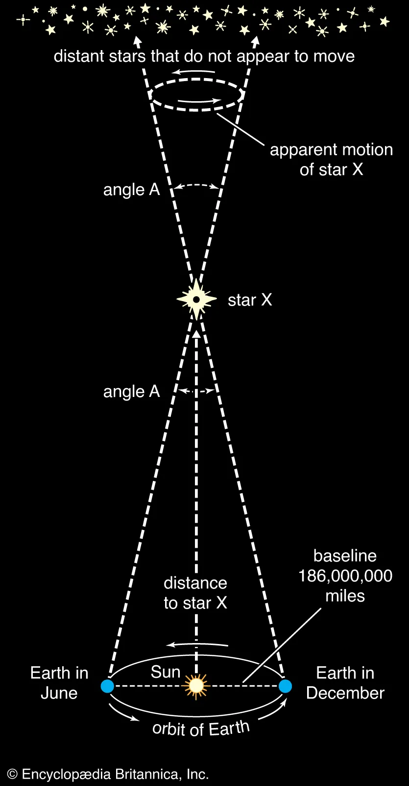
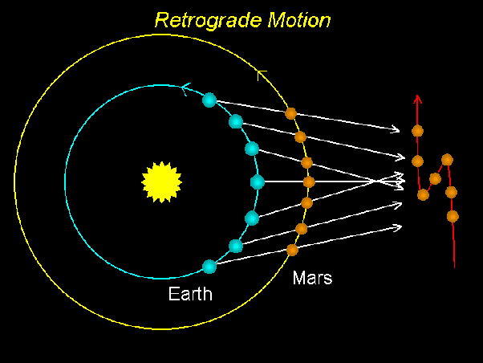

# Intro To Astronomy HW 2A

## Problem 1

### a) What’s the significance of the first supernova Tycho Brahe observed?

Before the discovery, it was thought that the heavens were unchanging- and so when he observed an appearance of a new star in the sky- it was a big deal. On the other hand, it was also a big deal because it allowed future astronomers to use the data to develop a better understanding of the universe.

### b) Why didn’t Tycho detect stellar parallax?

Tycho had to make observations with the naked eye. From this diagram you can see how stellar parallax's work:

As you can see, as the stars get farther from us, it become harder to see the parallax. No star was close enough to Tycho to be able to detect the parallax with just his eyes. It's only when Galileo looked at the stars with a telescope that he was able to detect the parallax.

### c) Why do we sometimes see Mars moving backward in the sky?

Mars moves backwards due to the way that the Earth and Mars orbit the sun. It just so happens (show below) that Mars orbits the sun slower than the Earth. So, when the Earth passes Mars, it appears to move backwards.

### d) List at least 2 pieces of evidence ancient philosophers/astronomers used to support the Sun-centered model instead of the earth-centered model as we discussed in class. (2 pts)

1. The phases of Venus - Venus goes through phases like the moon does. This is only possible if Venus is orbiting the sun.

2. The retrograde motion of Mars - Mars appears to move backwards in the sky. This is only possible if the Earth is moving faster than Mars. (Though some individuals like Ptolemy tried to explain this with epicycles)

## Problem 2

### A planet is orbiting a star of 1 solar mass with an orbital period of 71 months. What is the semimajor axis of the planet’s orbit (you have to state the unit as well)?

- $P = 71 \text{ months}$
- $M = 1 \text{ solar mass}$

$$
\begin{align*}
p^2 &= a^3 \\
(71/12)^2 &= a^3 \\
a &\approx 3.27128264 \text{ AU}
\end{align*}
$$

## Problem 3

### NASA’s OSIRIS-REx mission is the first US mission to retrieve a sample from an asteroid (Bennu, mass 7.8e10 kg, radius 250 m) and return it to Earth. OSIRIS-REx was launched in 2016, arrived Bennu in 2018, touched down on the asteroid on Oct. 20, 2020, and returned sample back to earth on September 24, 2023. Suppose you are funded to launch a new orbiter to orbit around the asteroid Bennu, and you’ve decided it’d be good for your orbiter to orbit at a height of 1.5 km above the surface of Bennu. What would the orbital speed (in m/s) of your orbiter be at that height? You can assume the asteroid is spherical and the orbit is perfectly circular. (Feel free to review the lecture slides/notes where we derived the expression for orbital speed.)

- $G = 6.674 \times 10^{-11} \text{ m}^3 \text{ kg}^{-1} \text{ s}^{-2}$
- $M = 7.8 \times 10^{10} \text{ kg}$
- $R = 250 \text{ m}$
- $h = 1.5 \times 10^3 \text{ m}$

$$
\begin{align*}
v &= \sqrt{\frac{GM}{R + h}} \\
&= \sqrt{\frac{6.674 \times 10^{-11} \times 7.8 \times 10^{10}}{250 + 1.5 \times 10^3}} \\
&\approx 0.05454 \text{ m/s}
\end{align*}
$$

## Problem 4

### In class we discussed how to use conversation of energy to figure out escape speed, the initial speed needed for a “satellite” object to escape (i.e. speed reduces to 0 when it reaches infinity). Recall that the total orbital energy is the sum of kinetic energy (mv2 /2) and gravitational potential energy (−GMm/r). Now, let’s use the same method to figure out the “impact speed”. Imagine a meteorite heading towards Mars. If the meteorite’s speed is 0 when it’s infinitely far away from Mars, what would its speed be when it hits the surface of Mars? You can think of it as the reverse of the “escape problem” discussed in class. List the initial kinetic energy and potential energy at infinity, as well as the final kinetic energy and potential energy at impact. And you might want to look up the radius and mass of Mars.

- $G = 6.674 \times 10^{-11} \text{ m}^3 \text{ kg}^{-1} \text{ s}^{-2}$
- $M_{\text{Mars}} = 6.42 \times 10^{23} \text{ kg}$
- $R_{\text{Mars}} = 3.39 \times 10^6 \text{ m}$

$$
\begin{align*}
v_{\text{escape}} &= \sqrt{\frac{2GM}{R}} \\
&= \sqrt{\frac{2 \times 6.674 \times 10^{-11} \times 6.42 \times 10^{23}}{3.39 \times 10^6}} \\
&\approx 5.03 \times 10^3 \text{ m/s}

\end{align*}
$$
