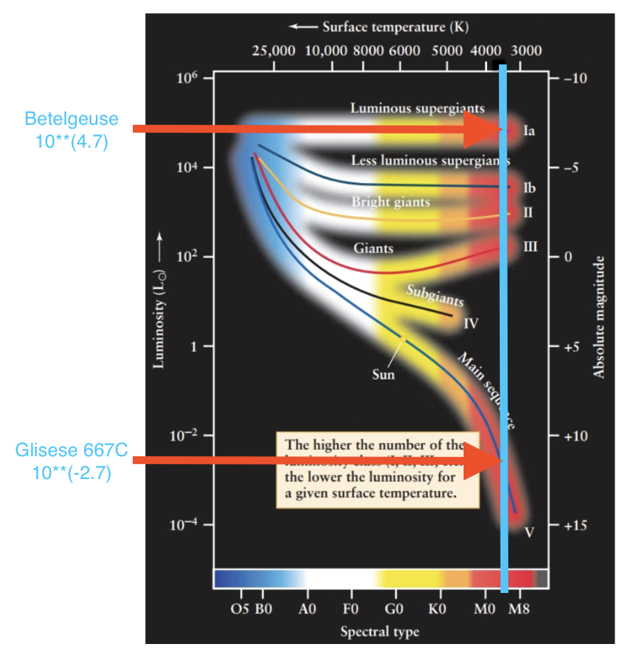

# Intro To Astronomy HW 3

## Problem 1

### Problem 1 (2 pts). If star A has an effective temperature 2/5 that of star B, how large does star A have to be (i.e. calculate the radius ratio between the two stars RA /RB ) for it to have the same luminosity as star B?

$$
\begin{align*}
L &= 4\pi R^2 \sigma T^4
\end{align*}
$$

$$
\begin{align*}
4\pi R_A^2 \sigma (2/5 T_B)^4 &= 4\pi R_B^2 \sigma T_B^4 \\
R_A^2 (2/5)^4 &= R_B^2 \\
\frac{R_A}{R_B} &= (2/5)^{-2} = 6.25\\
\end{align*}
$$

## Problem 2.

### a) (2 pts) From Earth (with the standard baseline of 1 AU), if we observe the parallax angle of a star to be 0.45 arcseconds, what is the distance to this star in parsecs? What is that distance in light years?

$$
\begin{align*}
d \text{ (in pc)} = \frac{1}{p} \text{ (in arcsec)} = \frac{1}{0.45} = 2.22 \text{ pc}
\end{align*}
$$

$$
\begin{align*}
d \text{ (in ly)} = 3.26 \times d \text{ (in pc)} = 3.26 \times 2.22 = 7.237 \text{ ly}
\end{align*}
$$

### b) (2 pts) If through some other method we know that the distance to a star is 166.7 light years, what do you expect its parallax angle (in arcseconds) to be, as observed from Earth (with th standard 1AU baseline)?

$$
\begin{align*}
p = \frac{1}{d} = \frac{1}{(\frac{166.7}{3.26})} = \frac{1}{51.1} = 0.01955608878 \text{ arcsec}
\end{align*}
$$

## Problem 3.

Consider two stars Gliese 667C and Betelgeuse. From spectroscopic observations we conclude that they both have the same spectral type M1, and therefore the same surface temperature of ~3700 K. Further spectral feature analyses show that Gliese 667C has luminosity class of V (i.e. on the main sequence), and Betelgeuse has luminosity class of Ia (luminous supergiant).

### a) (3 pts) On the HR diagram below, pinpoint the locations of Gliese 667C and Betelgeuse by drawing a vertical line through the M1 spectral type, and find its intersection with the luminou supergiant and main-sequence luminosity class. From the locations of Gliese 667C an Betelgeuse on the HR diagram, draw horizontal lines towards the luminosity axis to determin the luminosities of these two stars. Write down the luminosities of Gliese 667C and Betelgeus on the luminosity axis – a ballpark estimate from eyeballing the numbers on the axis i sufficient. You need to show this HR diagram with your drawings on it in your submission.

**Gliese 667C**: $10^{-2.7} L_{\odot}$

**Betelgeuse**: $10^{4.7} L_{\odot}$

### b) (2 pts) Based on the information in this question, what is the ratio of Gliese 667C’s radius to that of Betelgeuse, RGli / RBet ?

$$
\begin{align*}
\frac{L_A}{L_B} &= \frac{R_A^2 T_A^4}{R_B^2 T_B^4} \\
\frac{R_A}{R_B} &= \sqrt{\frac{L_A}{L_B}} \\
\frac{R_A}{R_B} &= \sqrt{\frac{10^{-2.7}}{10^{4.7}}} \\
\frac{R_A}{R_B} &= 0.000199526231
\end{align*}
$$
