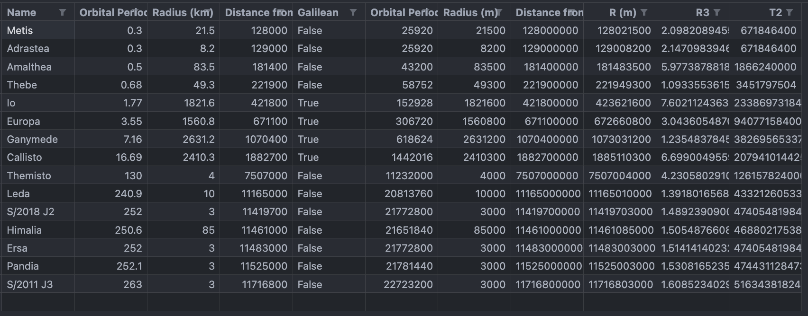
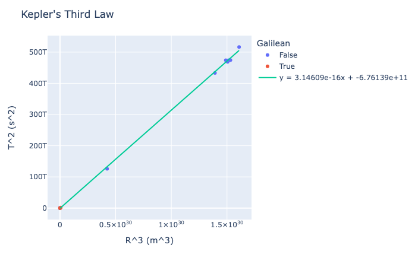
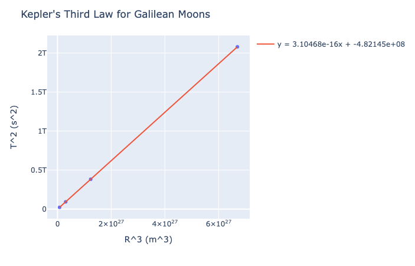

# Lab 1 - Intro to Astronomy

## Introduction

The goal of this lab was to calculate the mass of Jupiter using the orbital period and distance of one of its moons. From the Newton's version of Kepler's third law, we can relate the orbital period and orbital radius using the following equation:

$$
T^2 = \frac{4\pi^2}{GM}R^3
$$

- $T$ is the orbital period
- $R$ is the orbital radius
- $M$ is the combined mass of the planet and the orbiting mass (we can ignore the mass of the moon due to its small mass compared to Jupiter)
- $G$ is the gravitational constant

Now, in actuality the calculated constant ($\frac{4\pi^2}{GM}$) may differ between different moons due to a variety of factors.

In this lab, we will plot the orbital period and orbital radius of Jupiter's moons and use the slope of the line to calculate the mass of Jupiter.

## Data

After collecting data on the orbital period and orbital radius of Jupiter's moons (https://www.britannica.com/topic/moons-of-Jupiter-2236909), I prepared a python script to format it and do the calculations. Check my github repository for the code (https://github.com/mattraghu/Spring2024/tree/main/Astronomy/Labs/Lab1).

## Plots

### All Moons

### Galilean Moons

## Jupiter's Mass

### All Moons

$ m = 3.146086440304132e-16 $

$$
\begin{align*}
M &= \frac{4\pi^2}{Gm} \\
&= \frac{4\pi^2}{6.67430e-11 \cdot 3.146086440304132e-16} \\
&= 1.88011e+27 kg
\end{align*}
$$

### Galilean Moons

$m = 3.104676779596539e-16$

$$
\begin{align*}
M &= \frac{4\pi^2}{Gm} \\
&= \frac{4\pi^2}{6.67430e-11 \cdot 3.104676779596539e-16} \\
&= 1.90519e+27
\end{align*}
$$

## Conclusion

Compared to the actual mass of Jupiter (1.8982e+27 kg) (https://nssdc.gsfc.nasa.gov/planetary/factsheet/jupiterfact.html) the calculated mass is very close. (For all the moons the percent error was -.953% and for the Galilean moons the percent error was .368%)

It goes to show how powerful Kepler's laws are and how they can be used to calculate the mass of celestial bodies. Of course, it is also important to be aware of the limitations of the model as real life factors can affect the results.
