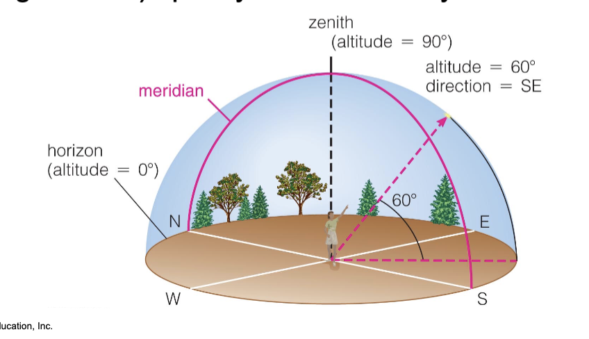

# Intro to Astronomy

## What is Astronomy?

Astronomy is the study of the **universe**, its history, physical properties, laws that regulate it and everything in it.

It is the study of celestial objects such as: stars, planets, comets, and galaxies

## The Local Sky

- **Altitude** is the angle above the horizon
- **Azimuth** is the angle along the horizon

- **Zenith** is the point directly above you
- **Meridian** is the line that goes from the North to the South
- **Horizon** is the line that separates the sky from the ground

### Measurments

- Full circle is $360^{\circ}$
- $1^{\circ} = 60'$ (arcminutes)
- $1' = 60''$ (arcseconds)

### Angular Size

$$
\text{Angular Size} = \frac{\text{Physical Size}}{\text{Distance}| \times \frac{360^{\circ}}{2\pi}
$$

## The Celestial Sphere

- The celestial sphere is an imaginary sphere that surrounds the Earth
- It is divided into 88 constellations
- The **celestial equator** is the projection of the Earth's equator onto the celestial sphere
- The **ecliptic** is the path the Sun takes through the celestial sphere

### The North and South Celestial Poles

- The **North Celestial Pole** is the point in the sky directly above the Earth's North Pole
- The **South Celestial Pole** is the point in the sky directly above the Earth's South Pole

### The Motion of the Stars

- The stars appear to move from East to West
- This is due to the Earth's rotation (West to East)
- The stars are fixed on the celestial sphere

## Newton

### One Universe

The heavens and the Earth are governed by the same set of physical laws

ONE UNIVERSE

### The Laws of Motion

- **Newton's First Law** : An object at rest will stay at rest and an object in motion will stay in motion unless acted upon by an external force
- **Newton's Second Law** : The force acting on an object is equal to the mass of the object times its acceleration
- **Newton's Third Law** : For every action, there is an equal and opposite reaction

### Angular Momemntum

$$
\text{Angular Momentum} = \text{Mass} \times \text{Velocity} \times \text{Radius}
$$

Reason why the Earth doesn't fall into the Sun

### Universal Gravitation

$$
F = \frac{G \times M_1 \times M_2}{R^2}
$$

$$
PE_{\text{gravity}} = -\frac{G \times M_1 \times M_2}{R}
$$

- $PE_{\text{gravity}}$ is the potential energy due to gravity
- $F$ is the force of gravity
- $G$ is the gravitational constant
- $M_1$ and $M_2$ are the masses of the two objects
- $R$ is the distance between the two objects

Mass is also potential energy (Einstein)

$$
E = mc^2
$$

## Kepler's Laws

### Kepler's First Law

The orbit of a planet is an ellipse with the Sun at one of the two foci

One tack is the sun.

### Kepler's Second Law

A line segment joining a planet and the Sun sweeps out equal areas during equal intervals of time

$$ A = B $$

### Kepler's Third Law

$$
P^2 \propto r^3
$$

The square of the orbital period of a planet is directly proportional to the cube of the semi-major axis of its orbit

$$
\begin{align*}
\frac{GM}{4\pi^2} & = \frac{d^3}{T^2} \\
\end{align*}
$$

So we know that ratio is a constant

### Newton's Version

$$
P^2 = \frac{4\pi^2}{G(M_1 + M_2)}a^3
$$

- $P$ is the orbital period
- $G$ is the gravitational constant
- $M_1$ and $M_2$ are the masses of the two objects
- $a$ is the semi-major axis of the orbit

### Orbital Velocity

$$
v = \sqrt{\frac{GM}{R}}
$$

- $v$ is the orbital velocity
- $G$ is the gravitational constant ($6.674 \times 10^{-11} \text{m}^3 \text{kg}^{-1} \text{s}^{-2}$)
- $M$ is the mass of the object being orbited
- $R$ is the distance between the two objects

Proof:

$$
\begin{align*}
F & = \frac{G(M_1  M_2)}{R^2} \\
a & = \frac{v^2}{R} \\
F & = M_1a \\
\frac{G(M_1  M_2)}{R^2} & = M_1\frac{v^2}{R} \\
\frac{GM_2}{R} & = v^2 \\
v & = \sqrt{\frac{GM}{R}}

\end{align*}
$$

### Escape Velocity

The minimum velocity needed to escape the gravitational pull of an object. Also the impact velocity of an object falling from infinity to the surface of the object.

$$
v_{\text{escape}} = \sqrt{\frac{2GM}{R}}
$$

Proof:

$$
\begin{align*}
\text{Kinetic Energy} & = \text{Potential Energy} \\
\frac{1}{2}mv^2 & = \frac{GMm}{R} \\
v^2 & = \frac{2GM}{R} \\
v & = \sqrt{\frac{2GM}{R}}
\end{align*}
$$

## Important Numbers

- **Gravitational Constant ($G$)** : $6.674 \times 10^{-11} \text{m}^3 \text{kg}^{-1} \text{s}^{-2}$
- **Mass of the Earth** : $5.972 \times 10^{24} \text{kg}$
- **Mass of the Sun** : $1.989 \times 10^{30} \text{kg}$
- **Distance from the Earth to the Sun** : $1.496 \times 10^{11} \text{m}$ = 1 AU
- **Radius of the Earth** : $6.371 \times 10^{6} \text{m}$

## History of Astronomy

### The Greeks

**Geocentric Model** : The Earth is at the center of the universe and the planets move in circles around it

Noticed a period of **retrograde motion** in the sky

- **Retrograde Motion** : The apparent motion of a planet in a direction opposite to that of other bodies within its system as observed from a particular vantage point
- Planets usually move from West to East relative to the stars. However, they sometimes appear to move from East to West for a short period of time.
- Plato and Aristotle believed that the Earth was at the center of the universe

#### Ptolemy (100-170 AD)

- Created a model (Ptolemaic Model) that explained retrograde motion using **epicycles**
- **Epicycles** : Small circles that planets move in as they orbit the Earth

#### Aristarchus (310-230 BC)

- First to propose a **heliocentric model** (Sun at the center of the universe)
- He noticed that the stars are much farther away than the Sun

### The Middle Ages

- The Church was the main authority

#### Copernicus (1473-1543)

- Proposed a heliocentric model
- He was the first to use the term "revolution" to describe the Earth's motion around the Sun

### The Renaissance

#### Tycho Brahe (1546-1601)

- Made the most accurate measurements of the positions of the stars and planets
- Showed that geocentric and heliocentric models were both incorrect through his observations
- Would lead to Kepler's Laws

#### Kepler (1571-1630)

- Used Brahe's data to come up with his laws (see above)

### The Scientific Revolution

#### Galileo (1564-1642)

- Used a telescope to observe the sky
- Discovered the moons of Jupiter, the phases of Venus, and sunspots
- The only way for the phases of Venus to occur as he observed was if it was orbiting the Sun
- After it was essentially proven that the Earth was not at the center of the universe
