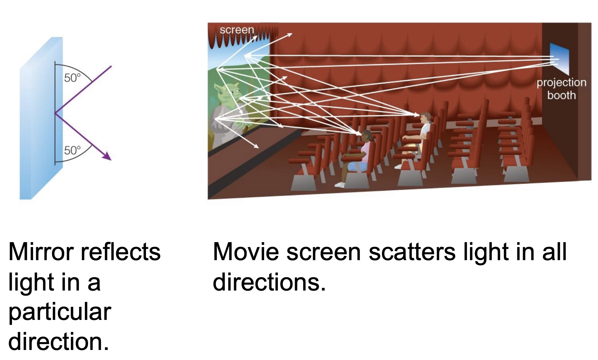

# Chapter 5 - Light The Cosmic Messenger

## What is Light?

Light is an **electromagnetic wave** of **oscillating electric and magnetic fields**. It is a form of energy that can be described by its **wavelength ($\lambda$)** and **frequency ($\nu$)**.

$$
c = \lambda \nu
$$

Where $c$ is the speed of light, $\lambda$ is the wavelength, and $\nu$ is the frequency.

### The Electromagnetic Spectrum

The **electromagnetic spectrum** is the range of all possible frequencies of electromagnetic radiation

### Particles

**Photons** : The particles that make up light. They have no mass and travel at the speed of light.

Wait but I thought electrons were the particles that made up light?

No, electrons are the particles that make up the atoms that emit light. Photons are the particles that make up light itself. As an example, if a lamp is turned on, the electrons in the atoms of the filament will become excited and emit photons. These photons are what we see as light.

In other words, photons are the **carriers of the electromagnetic force** and electrons are the **carriers of the electric force**.

$$
E = h \nu
$$

Where $E$ is the energy of the photon, $h$ is Planck's constant ($6.626 \times 10^{-34} \text{J s}$), and $\nu$ is the frequency of the photon.

### Quick Chemistry Refresher

**Atomic Number** : The number of protons in the nucleus of an atom. It is denoted by the letter $Z$.

**Mass Number** : The total number of protons and neutrons in the nucleus of an atom. It is denoted by the letter $A$.

**Isotopes** : Atoms of the same element (same # of protons) that have different numbers of neutrons.

**Molecules** : A group of atoms bonded together.

### Light Matter Interactions

**Absorption** : When an atom absorbs a photon, it gains energy and its electrons move to a higher energy level. Like the sun heating up the Earth.

**Emission** : When an atom emits a photon, it loses energy and its electrons move to a lower energy level. Like a light bulb emitting light.

**Transmission** : When a photon passes through an atom without being absorbed or emitted. Like light passing through a window.

**Reflection** : When a photon bounces off an atom. Like light bouncing off a mirror.

**Scattering** : When a photon is absorbed and then re-emitted in a different direction. Like the sky being blue.

### Radiation and the Earth's Atmosphere

The Earth's atmosphere is transparent to visible light, but opaque to ultraviolet and infrared light. Its like a bandpass filter.

### Doppler Effect

The **Doppler Effect** is the change in frequency or wavelength of a wave in relation to an observer who is moving relative to the wave source.

### Inverse Square Law

As you get farther away from a light source, the intensity of the light decreases.

$$
\text{Intensity} \propto \frac{1}{\text{Distance}^2}
$$

