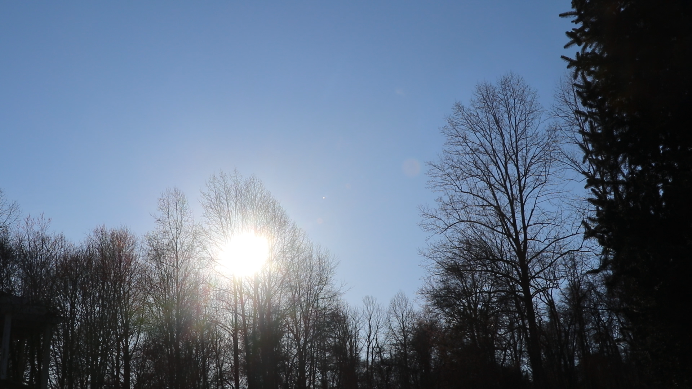

# Observational Assignment 1

## Introduction

The goal of this project was to monitor the position of the sun in the sky over the course of an hour. This was done by taking a video of the sun near sunset. By knowing where the picture was taken, the time the picture was taken, and the direction the camera was facing, the results can be compared with a simulation of the sun's position in the sky.

## Method

### Lat Long

As you can see the lat lon, and direction that the camera was facing is shown in the image above.

### Date and Time

The video was taken on 2024-03-21 at 5:15 PM EST.

### Simulation at 6AM, 12PM, and 6PM

Simulation on 2024-03-21 at 6AM EST

Simulation on 2024-03-21 at 12PM EST

Simulation on 2024-03-21 at 6PM EST

### Results

Based on these conditions, the simluation showed the following results:

Obviously it doesn't rise exactly due east and set exactly due west because of the tilt of the earth. I am not on the equator, but at a latitude of 42.3601° N. This means that the sun will rise and set a little bit north of east and west respectively.

You can see that we have just past the spring equinox, so the sun has started to move northward.

2024-03-21 5:15 PM EST

2024-03-21 5:25 PM EST

2024-03-21 5:35 PM EST

2024-03-21 5:45 PM EST

2024-03-21 5:55 PM EST

2024-03-21 6:05 PM EST

2024-03-21 6:15 PM EST

Compared to the simulation- it is spot on, with the sun almost completely set at 6:15 PM EST.

