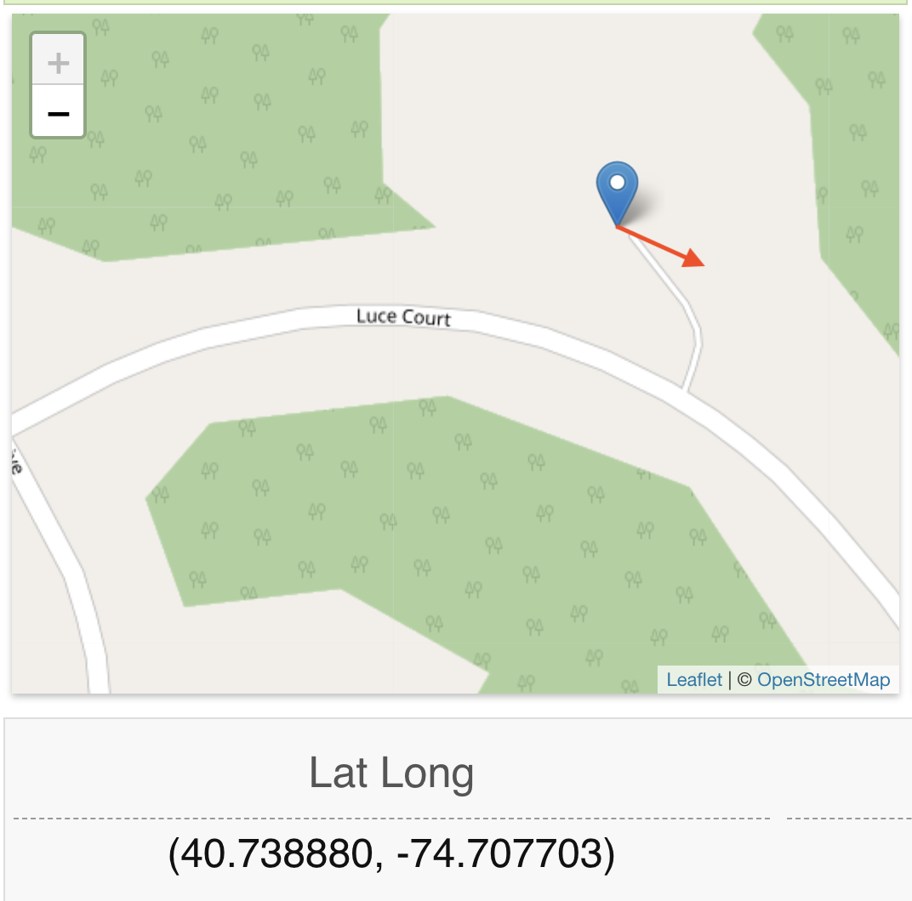

# Observational Assignment 2

## Moon

### Observation Info

- Location: (40.738880, -74.707703)
- Date: 04/22/2024
- Time: 10:30 PM - 11:30 PM

### Moon Simulation

During the observation it was actually a **waxing gibbous**. However, being that it was one day away from beeing a **full moon** I will use the full moon simulation.

As you can see, the moon is directly opposite the sun. This is why the moon is fully illuminated. The light from the sun is reflecting off the moon and back to us on Earth.
