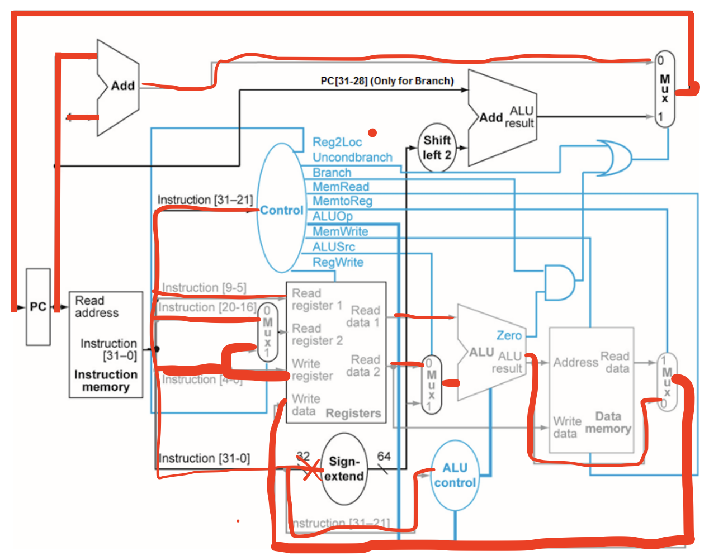

# Final - Digital And Computer Systems

Matthew Raghunandan

10460030

## Question 1

## a)

### Amdahl's law

Essentially, it lets you know how fast a program will speed up when only a portion of it is made faster.

$$
\text{Speedup Time} = \frac{\text{Affected Time}}{\text{Improvement Factor}} + \text{Unaffected Time}
$$

### Machine Code

Its the lowest level you can go in programming. It's basically a bunch of 1s and 0s that the computer can understand and translate into instructions.

## b)

### 8GB to bits

$$
8 \times 1024 \times 1024 \times 1024 \times 8 = 68,719,476,736 bits
$$

### 8388608 bits to MB

$$
\frac{8388608}{1024 \times 1024 \times 8} = 1 MB
$$

## Question 2

### FC+AE

$$
\begin{align*}
&\text{FC} + \text{AE} \\
&= ((15 \times 16^1) + (12 \times 16^0)) + ((10 \times 16^1) + (14 \times 16^0)) \\
&= 426
\end{align*}
$$

### b

## Question 3

Convert C++ code snippet to LEGv8 assembly code. The following variables
x, y, and z are associated with registers X19, X20, and X21 respectively, and base address
of the array A is in X22. Comment the code.

z = x + A[4];

A[8] = A[1] + z;

```assembly
// Get the values value of A[4] and store it in z
LDUR X21, [X22, #3]

// Add x
ADD X21, X21, X19

// Get the value of A[1]
LDUR X1, [X22, #1]

// Store the value of A[1] + z in A[8]
ADD X1, X1, X21
STUR X1, [X22, #8]
```

## Question 4

(10 Points) Convert IEEE-754 Single precision format to floating point: 0X40600000
N.B: You need to show the steps of calculation such as: showing the sign, exponent, and fraction.

### Convert To Binary

$$
4 = 0100 \\
0 = 0000 \\
6 = 0110 \\
$$

0 1000 0000 1100 0000 0000 0000 0000 0000

### Three Components

$$
S = 0 \\
Exponent = 1000 0000 = 128 \\
Fraction = 1.1 \\
Bias = 127 \\
$$

### Calculation

$$
(-1)^0 \times (1 + 1.1) \times 2^{128-127} = 4.2
$$

## Question 5

### (a) Rewrite the assembly code and show stalls in the code if any (do not reorder the code)

```assembly
ADD X1, X2, X3
SUB X9, X1, X10 // Dependency on X1
ADDI X3, X3, #1
LSL X4, X11, #2
ADD X5, X5, X3 // Dependency on X3
```

### (b) Draw the multi-cycle pipeline diagram

| Instruction | CC 1 | CC 2 | CC 3 | CC 4 | CC 5 | CC 6 | CC 7 | CC 8 | CC 9 | CC 10 |
| ----------- | ---- | ---- | ---- | ---- | ---- | ---- | ---- | ---- | ---- | ----- |
| ADD         | IF   | ID   | EX   | DA   | WB   |      |      |      |      |
| SUB         |      | IF   | ID   | EX   | DA   | WB   |      |      |      |       |
| ADDI        |      |      | IF   | ID   | EX   | DA   | WB   |      |      |       |
| LSL         |      |      |      | IF   | ID   | EX   | DA   | WB   |      |       |
| ADD         |      |      |      |      | IF   | ID   | EX   | DA   | WB   |       |

### c) Explain how instruction-level parallelism (ILP) enables multiple instructions to overlap in execution within a pipeline processor

That would allow the processor to execute multiple instructions simultaneously or out of order to ensure that the CPU's resources are being utilized to the fullest- and to prevent any bottlenecks that could slow down the execution of a program.

### 6. (10 Points) Trace the data path taken by the instruction ADD X0, X1, X2. Mark the values of the control signals.



- Reg2Loc = 0
- Unconditionalbranch = 0
- Branch = 0
- MemRead = 0
- MemtoReg = 0
- ALUOOp = 10
- MemWrite = 0
- ALUSrc = 0
- RegWrite = 1

### 7.(7 points) What are the values of the control signals Reg2Loc, Branch, MemRead MemtoReg, MemWrite, and RegWrite and for the following instruction: LDUR X9, [X10, #4]

- Reg2Loc = N/A
- Branch = 0
- MemRead = 1
- MemtoReg = 1
- MemWrite = 0
- RegWrite = 1

## Question 8

### (a) (5 points) Explain the concept of SIMD (Single Instruction, Multiple Data) parallelism. Give specific examples where data-level parallelism can significantly improve performance.

SIMD is a type of parallelism that involves executing the same instruction on multiple pieces of data simultaneously. This can be seen in the GPU, where the same instruction can be executed on multiple pixels at the same time.

### b) (8 Points) Convert the virtual address 0X00D34234 to the physical address for a 32-bit machine with 256MB of RAM and 4KB of pages. A portion of the page table is given here:

00D34 = 0F34

So the physical address is 0x0F34234

## 9. (8 Points) Consider three different processors P1, P2, and P3 executing the same instruction set.

P1 P2 P3
Clock Rate 3.5 GHZ 3 GHZ 4.5 GHZ
CPI 1.5 1 2.5

### a. Which processor has the highest performance expressed in instructions per second?

### P1

$$
3.5E9 / 1.5 = 2.333E9
$$

### P2

$$
3E9 / 1 = 3E9
$$

### P3

$$
4.5E9 / 2.5 = 1.8E9
$$

So P2 has the highest performance.

### b. If the processors each execute a program in 10 seconds, find the number of cycles for each processor?

### P1

$$
3.5E9 \times 10 = 35E9
$$

### P2

$$
3E9 \times 10 = 30E9
$$

### P3

$$
4.5E9 \times 10 = 45E9
$$

## Question 10

The computation of cosine (in radians) is expressed by the above expression. Write an ARMv8 assembly program to compute the cosine value. Assume the input x is in D0 and the input a is in X19. Store the result in D1. The user input x is a double precision floating-point value between -5 and 5. The user input a is a 64-bit non-negative integer less than 16. Comment on your code

```assembly

b init

get_negative:
    // Get the negative value into x2 based on x3
    SUB X3, X3, #1
    CMP X3, #0
    B.LE got_negative

    MUL X2, X2, #-1
    b get_negative

get_factorial:
    // Get the factorial value into x4 based on x3
    SUB X3, X3, #1
    CMP X3, #0
    B.LE got_factorial

    MUL X4, X4, X3
    b get_factorial

get_power:
    // Get the power value into x5 based on x3
    SUB X3, X3, #1
    CMP X3, #0
    B.LE got_power

    MUL X5, X5, D0
    b get_power

end:
    // Compute the cosine value
    MUL D1, X2, X5
    B end


// Compute the cosine value
init:
    MOV X1, #0
    MOV X5, #0 # current sum
for:
    ADD X1, X1, #1

    // Check if a is less than 16
    CMP X19, #16
    B.GE end

    // Get Negative (x2)
    MOV X2, #0
    MOV X3, X1 // For the counter
    b get_negative

got_negative:
    // Compute the factorial (x4)
    MOV X4, #1
    MOV X3, X1
    LSL X3, X3, #1
    b get_factorial

got_factorial:
    // Compute the power (x5)
    MOV X5, D0
    MOV X3, X1
    LSL X3, X3, #1
    b get_power

got_power:
    # Now compute the total and add to sum
    DIV X3, X5, X4
    MUL X3, X3, X2
    ADD X5, X5, X3

    B for

end:
    // Store the result in D1
    MOV D1, X5

```
