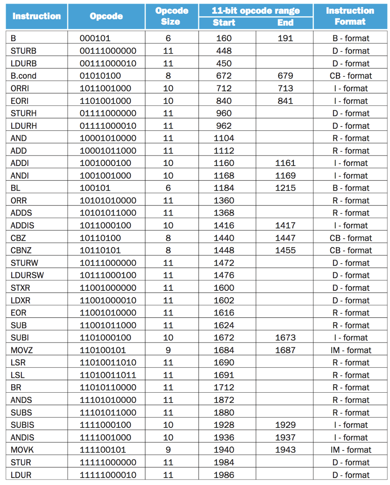
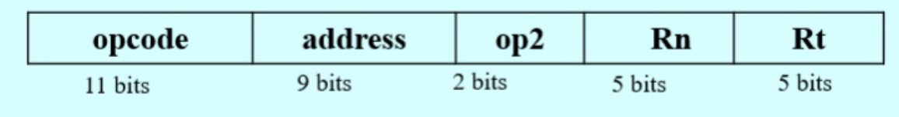
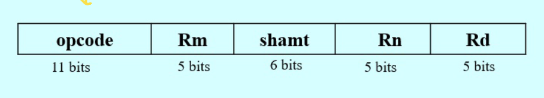

# Homework 2 - Digital and Computer Systems Architecture

## 1.) Convert the following assembly instructions to 32-bit machine code and change it to Hexadecimal format. (20 Points)



### a. LDUR X10, [X5, #16]


(D Format)

#### 32-bit machine code

```
11111000010 000010000 00 00101 01010
```

#### Hexadecimal format

```
0xF84100AA
```

### b. SUB X12, X14, X15


(R Format)

#### 32-bit machine code

```
11001011000 01111 000000 01110 01100
```

#### Hexadecimal format

```
0xCB0F01CC
```

## Convert the below C++ code snippet to LEGv8 assembly code. Assume variables a and b is stored in registers X19 and X20. The base address of c is stored in register X21. Comment on your assembly code. (20 Points)

```cpp
a = a + b;
c[b] = a + 2;
c[a-2] = b;
a = c[a] + b;
```

```assembly
// First we need a temporary register to store the size of a double word
SUBS X3, X3, X3
ADDI X3, X3, #8

// a = a + b
ADD X19, X19, X20

// a + 2
ADDI X2, X19, #2

// Get the address of c[b] (X1)
MUL X1, X20, X3
ADD X1, X21, X1


// Store a + 2 in c[b]
STUR X2, [X1, #0]

// Get the address of c[a-2] (X2)
SUBI X2, X19, #2
MUL X2, X2, X3
ADD X2, X21, X2

// Store b in c[a-2]
STUR X20, [X2, #0]

// Get the address of c[a] (X1)
MUL X1, X19, X3
ADD X1, X21, X1

// Get the value of c[a] and store it in X2
LDUR X2, [X1, #0]

// a = c[a] + b
ADD X19, X2, X20
```

## 3.) Convert each of the below C++ code snippet to LEGv8 assembly code. Assume variables a, b, and c is stored in registers X19, X20, and X21 respectively. The base address of d is stored in register X22. Comment on your assembly code. (20 Points)

### a.

```cpp
if (a > b) d[a] = b + 8;
else d[a] = b – 16;
```

```assembly
// Create a temporary register to store the size of a double word
SUBS X3, X3, X3
ADDI X3, X3, #8

// Compare a and b
SUBS XZR, X19, X20

// If a > b
B.LE else

// Get the address of d[a] (X1)
MUL X1, X19, X3
ADD X1, X22, X1

// Get the value of b + 8 (X2) and store it in d[a]
ADDI X2, X20, #8
STUR X2, [X1, #0]

// Jump to the end of the if statement
B end

else:
// Get the address of d[a] (X1)
MUL X1, X19, X3
ADD X1, X22, X1

// Get the value of b - 16 (X2) and store it in d[a]
SUBI X2, X20, #16
STUR X2, [X1, #0]

end:
```

### b.

```cpp
i = 0;
while (d[i] == b)
if ((a - i) > 0) i++;
```

```assembly
// Create a temporary register to store the size of a double word
SUBS X3, X3, X3
ADDI X3, X3, #8

// i = 0
SUBS X7, X7, X7

while:
// Get the address of d[i] (X1)
MUL X1, X7, X3

// Get the value of d[i] and store it in X2
LDUR X2, [X22, X1]

// Compare d[i] and b
SUBS XZR, X2, X20

// If d[i] == b
B.NE endWhile

// If (a - i) > 0
SUBS XZR, X19, X7
B.LE while

// i++
ADDI X7, X7, #1

// Jump to the beginning of the while loop
B while

endWhile: // End of the while loop
```

## 4.) Write a LEGv8 assembly code to find the largest and smallest of n non-zero positive integers. Assume the value of n is stored in register X19 and each of the n values is stored in an array. Each element of the array is 8 bytes long and the array’s base address is stored in register X20. Store the largest and smallest values in register X21 and X22 respectively. Comment on your assembly code. (20 Points)

```assembly
// Create a temporary register to store the size of a double word
SUBS X3, X3, X3
ADDI X3, X3, #8

// Set the largest and smallest values to the first element of the array
LDUR X21, [X20, #0]
LDUR X22, [X20, #0]

// Set the next address to the second element of the array
ADDI X20, X20, #8

// Loop through the array
for:
// Decrement the value of n
SUBI X19, X19, #1

// If n == 0, exit the loop
CBZ X19, end

// Increment the address to the next element of the array
ADDI X20, X20, #8

// Get the value of the current element of the array and store it in X1
LDUR X1, [X20, #0]

// Compare the current element of the array with the largest value
SUBS XZR, X1, X21
B.GT skipLargest // If the current element is not greater than the largest value, skip to the next step

// Store the current element of the array in the largest value
ADDI X21, X1, #0

skipLargest:
// Compare the current element of the array with the smallest value
SUBS XZR, X1, X22
B.LT for // If the current element is not less than the smallest value, skip to the next step

// Store the current element of the array in the smallest value
ADDI X22, X1, #0

// Jump to the beginning of the loop
B for

end: // End of the loop
```

## 5.) Write a C++ program to find the sum of first n natural numbers using recursion. The user inputs the value of n. Convert the C++ program to LEGv8 assembly code. The value of n is stored in register X19. Store the sum in register X20. Assume all values are 64-bits. cout and cin statement are not required to be converted into assembly. Comment on your code. (20 Points)

```cpp
#include <iostream>
using namespace std;

int sum(int n) {
    if (n == 0) return 0; // Base case.
    return n + sum(n - 1); // Add the current value of n to the sum of the previous n
}

int main() {
    int n;
    cout << "Enter a positive integer: ";
    cin >> n;
    cout << "Sum = " << sum(n);
    return 0;
}
```

```assembly
// Initialize X20 (sum) to 0
SUBS X20, X20, X20

// Check if n is 0, in which case the sum is 0, and we can skip the calculations
CBZ X19, end

// Initialize a counter in X0, starting from 1 (as we're summing natural numbers starting from 1)
SUBS X0, X0, X0
ADDI X0, X0, #1

// Loop to sum the numbers from 1 to n
loop:
    // Add the current number (X0) to the sum (X20)
    ADD X20, X20, X0

    // Increment the current number
    ADDI X0, X0, #1

    // Compare if we've added up to n numbers
    SUBS XZR, X0, X19
    B.LE loop // If the current number is less than or equal to n, continue the loop

// End of calculation
end:       
```
