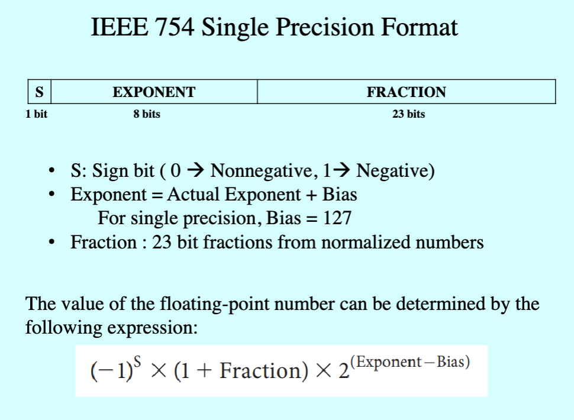
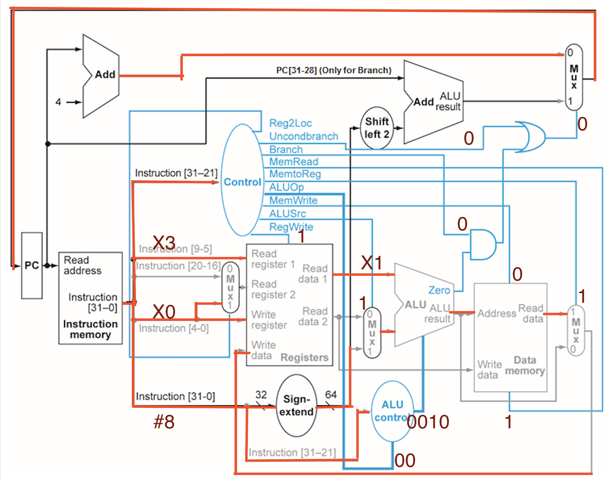

# Homework 3- Digital and Computer Systems Architecture

## Convert the following floating-point value -8.5 to IEEE-754 single format. Convert the result into hexadecimal and show all the steps of calculation. (15 Points)

### Convert To Binary

$$
8/2 = 4 {\text{ remainder }} 0 \\
4/2 = 2 {\text{ remainder }} 0 \\
2/2 = 1 {\text{ remainder }} 0 \\
1/2 = 0 {\text{ remainder }} 1 \\
8 = 1000
$$

$$
0.5 \times 2 = 1.0 \\
(1.0 - 1) \times 2 = 0.0 \\
0.5 = 0.1
$$

### Normalized

$$
1.0001 \times 2^{3}
$$

### Calculation of the three componenets



$$
S = 1 \\
\text {Fraction} = 0.0001 \\
\text {Bias} = 127 \\
\text {Exponent} = 3 + 127 = 130 = 10000010
$$

$$
1, 10000010, 00010000000000000000000
$$

### Convert to Hexadecimal

$$
1100 \rightarrow C \\
0001 \rightarrow 1 \\
0000 \rightarrow 0 \\
1000 \rightarrow 8 \\
$$

$$
0xC1080000
$$

## 2. Perform the following computation and convert the resulting floating-point values to IEEE-754 single precision format. Write your converted result in hexadecimal format: (15 Points) • – 7.25 \* 6.5

### Convert To Binary

#### 7.25

$$
7/2 = 3 {\text{ remainder }} 1 \\
3/2 = 1 {\text{ remainder }} 1 \\
1/2 = 0 {\text{ remainder }} 1 \\
7 = 111
$$

$$
0.25 \times 2 = 0.5 \\
0.5 \times 2 = 1.0 \\
0.25 = 0.01
$$

#### 6.5

$$
6/2 = 3 {\text{ remainder }} 0 \\
3/2 = 1 {\text{ remainder }} 1 \\
1/2 = 0 {\text{ remainder }} 1 \\
6 = 110
$$

$$
0.5 \times 2 = 1.0 \\
0.5 = 0.1
$$

### Normalized

#### 7.25

$$
1.1101 \times 2^{2}
$$

#### 6.5

$$
1.101 \times 2^{2}
$$

### Add Exponents

$$
e = 2 + 2 = 4
$$

### Multiply Significands

$$
1.1101 \times 1.101 = 1.100101
$$

### Normalized Result

$$
1.100101 \times 2^{4}
$$

### Single Precision

$$
S = 1 \\
\text {Fraction} = 0.100101 \\
\text {Bias} = 127 \\
\text {Exponent} = 4 + 127 = 131 = 10000011
$$

$$
1, 10000011, 10010100000000000000000
$$

### Convert to Hexadecimal

$$
1100 \rightarrow C \\
0000 \rightarrow 0 \\
0011 \rightarrow 3 \\
1001 \rightarrow 9 \\
$$

$$
0xC0398000
$$

## 3. Trace the data path taken by the instruction LDUR X2, [X3, #8] using Datapath source diagram. Mark the values of the control signals. (15 Points)



## 4. What is instruction-level parallelism (ILP) and discuss the role of pipelining in achieving ILP. (10 Points)

Instruction-Level Parallelism concept focused on improving the performance of a CPU. It involves executing multiple instructions simultaneously or out of order to better utilize the CPU's resources and reduce the execution time of a program.

Pipelining is a critical technique in achieving ILP. It divides the execution of an instruction into multiple stages that are processed in parallel by different hardware units. This enables the processor to begin executing different instructions before the previous ones have completed all stages. Common pipeline stages include instruction fetch, decode, execute, and write-back. As an example, you can have another instruction being fetched while the current instruction is being decoded.

## 5. Draw the multicycle pipelined diagram for the following code: (15 Points)

```assembly
ADD X3, X0, X1
SUB X6, X4, X5
LSL X7, X0, #2
STUR X9, [X10, #0]
ADDI X12, X12, #1
```

| Instruction | CC 1              | CC 2               | CC 3               | CC 4               | CC 5               | CC 6               | CC 7        | CC 8        | CC 9       | CC 10 |
| ----------- | ----------------- | ------------------ | ------------------ | ------------------ | ------------------ | ------------------ | ----------- | ----------- | ---------- | ----- |
| ADD         | Instruction Fetch | Instruction Decode | Execution          | Data Access        | Write Back         | -                  | -           | -           | -          | -     |
| SUB         | -                 | Instruction Fetch  | Instruction Decode | Execution          | Data Access        | Write Back         | -           | -           | -          | -     |
| LSL         | -                 | -                  | Instruction Fetch  | Instruction Decode | Execution          | Data Access        | Write Back  | -           | -          | -     |
| STUR        | -                 | -                  | -                  | Instruction Fetch  | Instruction Decode | Execution          | Data Access | Write Back  | -          | -     |
| ADDI        | -                 | -                  | -                  | -                  | Instruction Fetch  | Instruction Decode | Execution   | Data Access | Write Back | -     |

## 6.

```assembly
SUBI X2, X2, #1
LSL X4, X2, #1
SUB X5, X9, X6
LDUR X7, [X0, #0]
ADDI X7, X7, #1
```

### a. Identify Data hazards and number of stalls in the assembly code. Assume there is no forwarding. Rewrite the assembly code and show stalls in the code if any. (10 Points)

1. `LSL X4, X2, #1` depends on the result of `SUBI X2, X2, #1`.
2. `ADDI X7, X7, #1` depends on the result of `LDUR X7, [X0, #0]`.

The number of stalls = 2

### b. Modify the above code with forwarding to reduce the stalls without changing the functionality. (10 Points)

```assembly
SUBI X2, X2, #1
LDUR X7, [X0, #0]
SUB X5, X9, X6
LSL X4, X2, #1
ADDI X7, X7, #1
```

### c. Draw the multi-cycle pipeline diagram (one loop) for the optimized assembly code from section b. (10 Points)

| Instruction | CC 1              | CC 2               | CC 3               | CC 4               | CC 5               | CC 6               | CC 7        | CC 8        | CC 9       | CC 10 |
| ----------- | ----------------- | ------------------ | ------------------ | ------------------ | ------------------ | ------------------ | ----------- | ----------- | ---------- | ----- |
| SUBI        | Instruction Fetch | Instruction Decode | Execution          | Data Access        | Write Back         | -                  | -           | -           | -          | -     |
| LDUR        | -                 | Instruction Fetch  | Instruction Decode | Execution          | Data Access        | Write Back         | -           | -           | -          | -     |
| SUB         | -                 | -                  | Instruction Fetch  | Instruction Decode | Execution          | Data Access        | Write Back  | -           | -          | -     |
| LSL         | -                 | -                  | -                  | Instruction Fetch  | Instruction Decode | Execution          | Data Access | Write Back  | -          | -     |
| ADDI        | -                 | -                  | -                  | -                  | Instruction Fetch  | Instruction Decode | Execution   | Data Access | Write Back | -     |
