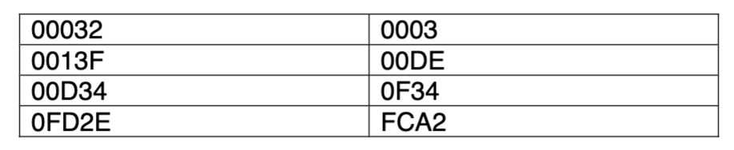

# Homework 4 - Digital and Computer Systems

## Question 1 - Describe the benefits of utilizing thread-level parallelism in a multi-core processor architecture

- Enhanced Performance - Multiple threads run simultaneously, speeding up task completion.
- Improved Responsiveness - Keeps applications responsive by managing background tasks on separate threads.
- Efficient Resource Utilization - Maximizes the use of all processor cores, avoiding wastage.
- Scalability - Facilitates handling more operations as demand increases.
- Concurrency - Allows multiple complex operations to run at the same time.
- Energy Efficiency - More effective use of cores can lead to lower energy consumption.

## Question 2 - Your instructor has given you a matrix multiplication program that utilizes multiple threads. The program divides the matrix multiplication into smaller tasks and assigns them to threads for parallel execution. However, there are concerns that the load balancing among threads is not optimal.

### Calculate the execution time for each of the 8 tasks (given data).

- Task 1: 200 ms
- Task 2: 180 ms
- Task 3: 220 ms
- Task 4: 170 ms
- Task 5: 240 ms
- Task 6: 190 ms
- Task 7: 210 ms
- Task 8: 175 ms

### Analyze the current load balancing among the 4 threads and calculate the total program execution time.

- Thread 1: Task 1,2
- Thread 2: Task 3,4
- Thread 3: Task 5,6
- Thread 4: Task 7,8

- Thread 1: 200 ms + 180 ms = 380 ms
- Thread 2: 220 ms + 170 ms = 390 ms
- Thread 3: 240 ms + 190 ms = 430 ms
- Thread 4: 210 ms + 175 ms = 385 ms

- Total Execution Time (highest b/c bottleneck) = 430 ms

### Identify performance issues with load balancing in the current setup.

- Thread 3 has significantly higher execution time, indicating a performance bottleneck.

### Propose a load balancing strategy to enhance performance and describe its implementation.

Assign tasks based on their execution time to balance the load among threads. This way no thread is overloaded, and the execution time is minimized.

- Thread 1: Task 5,4
- Thread 2: Task 3,8
- Thread 3: Task 7,2
- Thread 4: Task 1,6

### Calculate the expected total execution time after applying your load balancing strategy.

- Thread 1: 240 ms + 170 ms = 410 ms
- Thread 2: 220 ms + 175 ms = 395 ms
- Thread 3: 210 ms + 180 ms = 390 ms
- Thread 4: 200 ms + 190 ms = 390 ms

## Problem 3 - What is virtual memory, and why is it used in modern computing systems?

Virtual memory is a memory management technique that extends the available memory on a computer by using a portion of the disk storage to simulate additional RAM.

Why? Because it

- Allows systems to use more memory than physically available, enabling larger applications to run smoothly.
- Provides each process with its own address space, enhancing security and preventing applications from interfering with each other.
- Allows for the execution of multiple applications simultaneously without memory conflicts.
- Reduces the need for large amounts of physical memory, thus saving costs.

### Problem 4 - Convert the virtual address 0X0013F234 to the physical address for a 32-bit machine with 256MB of RAM and 4KB of pages. A portion of the page table is given here:

- Virtual Address: 0X0013F234

  - Virtual Page Number: = 0X013F

    - Maps to 00DE

  - Page Offset: 234

So the physical address is 0x00DE234
