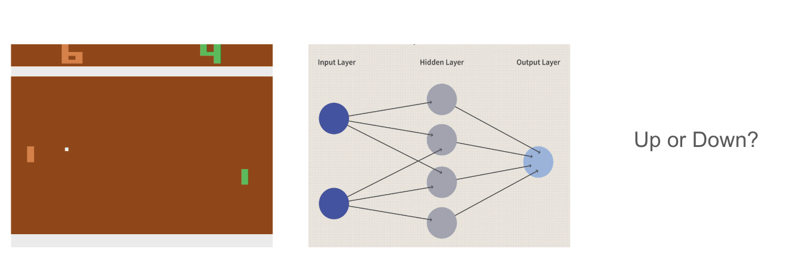
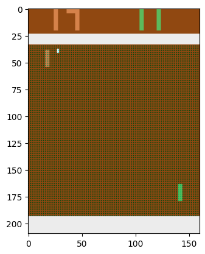
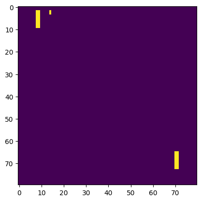

# Pong From Pixels - Final Project

## Problem Statement

How can we get from raw pixel data (RGB values) of a game of pong to an AI agent that can play the game?


## Methodology

### Preprocessing

We want to only get the important information from the screen.

```python
def preprocess(self, I):
    """ crunch down the input frame from the game to something more manageable """
    I = I[35:195]  # chop off the top and bottom of the image
    I = I[::2, ::2, 0]  # downsample by half in both dimensions
    I[I == 144] = 0  # remove the background color 1
    I[I == 109] = 0  # and background color 2
    I[I != 0] = 1  # everything else gets set to 1
    return I.astype(np.float32).ravel()
```




We also want to somehow get motion data. We do this by taking the difference between the current frame and the previous frame.

```python
x = cur_x - prev_x
```

### Forward Pass

```python
def forward(self, x):
    """ do the forward pass and figure out what action we should take """
    h = np.dot(self.model['W1'], x)
    h[h < 0] = 0  # ReLU nonlinearity
    raw_outputs = np.dot(self.model['W2'], h)
    p = 1.0 / (1.0 + np.exp(-raw_outputs))  # squash it to [0,1] (sigmoid function)
    return p, h  # gives us the probability of taking action and the hidden state
```

This outputs the probability of moving the paddle up. We can then sample from this probability to get the action.

Given this action, we can send that to the gym environment and get the reward.

### Backward Pass

#### Discounted Rewards

Gym will output a 1 when the agent scores, a -1 when the opponent scores, and a 0 otherwise.

To indicate a particular action was good or bad, we must look at the rewards that follow that action.

```python
def discount_rewards(self, rewards):
    """ take the rewards and make them more valuable the closer they are to now, cause we care more about the present, right? """
    discounted = np.zeros_like(rewards)
    running_add = 0
    for t in reversed(range(len(rewards))):
        if rewards[t] != 0:
            running_add = 0
        running_add = running_add * self.gamma + rewards[t]
        discounted[t] = running_add
    return discounted
```

For example, say we scored on frame 5, and our discount factor (gamma) is 0.7. Then the rewards would be:

```
[0.2401, .343, .49, .7, 1]
```

to indicate that the actions leading up to frame 5 were good with an exponential decay.

#### Normalize

Now we aim to normalize the rewards to have a mean of 0 and a standard deviation of 1. This is important for ensuring that the gradients don't explode or vanish.

```python
discounted_epr -= np.mean(discounted_epr)
discounted_epr /= np.std(discounted_epr)
```

#### Multiply

We can then multiply each reward by the probability that we originally calculated. Of course, if we rolled the opposite action then the reward multiplied would be negative.

#### Backward Pass

The goal is to find the derivative of the weights with respect to the rewards.

If you think about the way in which we originally calculated everything, we can just reverse the process, and use the chain rule to get the derivative of the weights with respect to the rewards.

```python
def backward(self, eph, epd_raw_output, epx):
    """ backprop to adjust our weights, cause we gotta learn from what happened """
    dW2 = np.dot(eph.T, epd_raw_output).ravel()
    dh = np.outer(epd_raw_output, self.model['W2'])
    dh[eph <= 0] = 0  # again, negative vibes rule doesn't apply here
    dW1 = np.dot(dh.T, epx)
    return {'W1': dW1, 'W2': dW2}
```

### Training

We can then use the derivative of the weights with respect to the rewards to update the weights.

```python
for k, v in self.model.items(): # k_0 = W1, k_1 = W2
    g = self.grad_buffer[k] # the grads are already calculated for that particular weight
    self.rmsprop_cache[k] = self.decay_rate * self.rmsprop_cache[k] + (1 - self.decay_rate) * g**2
    self.model[k] += self.learning_rate * g / (np.sqrt(self.rmsprop_cache[k]) + 1e-5)
```

This is called Root Mean Square Propagation, and it is a way to update the weights in a way that is more efficient than just using the gradient.

- **Grad_buffer** is the derivative of the weights with respect to the rewards.
- **Rmsprop_cache** is a cache of the previous updates to the weights.
- **Learning_rate** determines how much we update the weights by.
- **Decay_rate** determines how much we care about the previous updates to the weights.

## Results

(Video)
